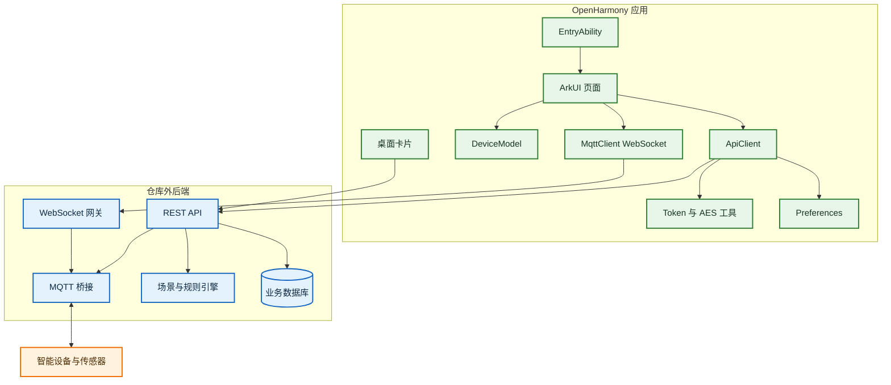
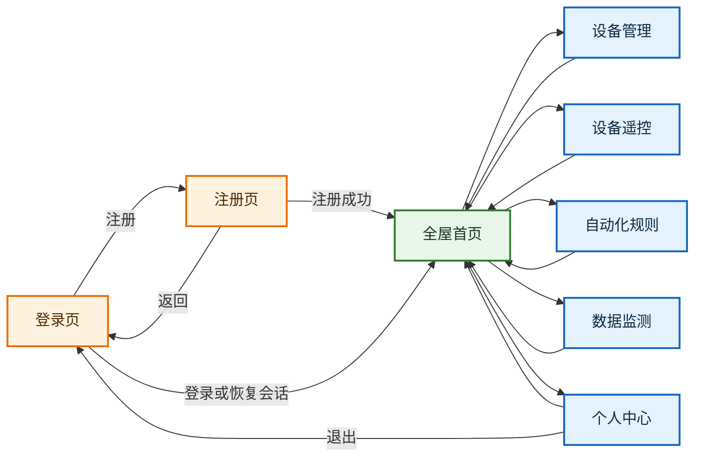
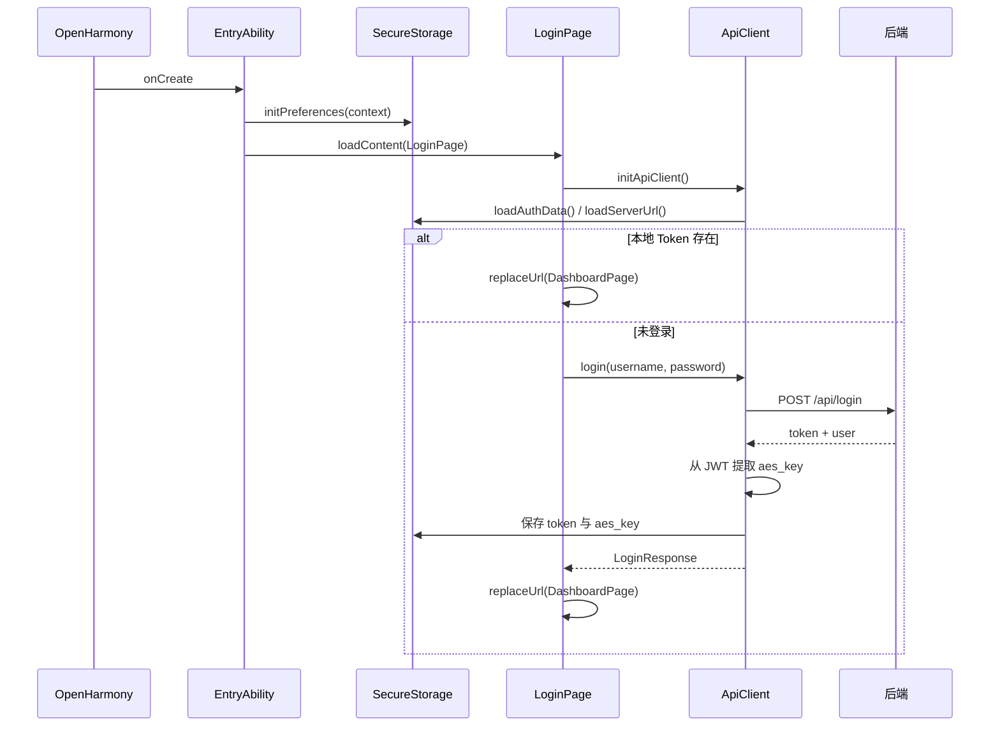
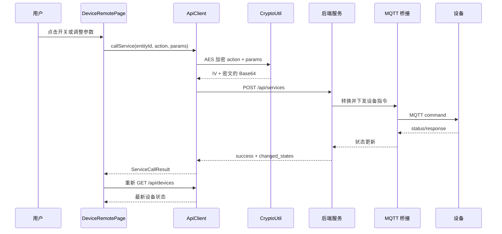
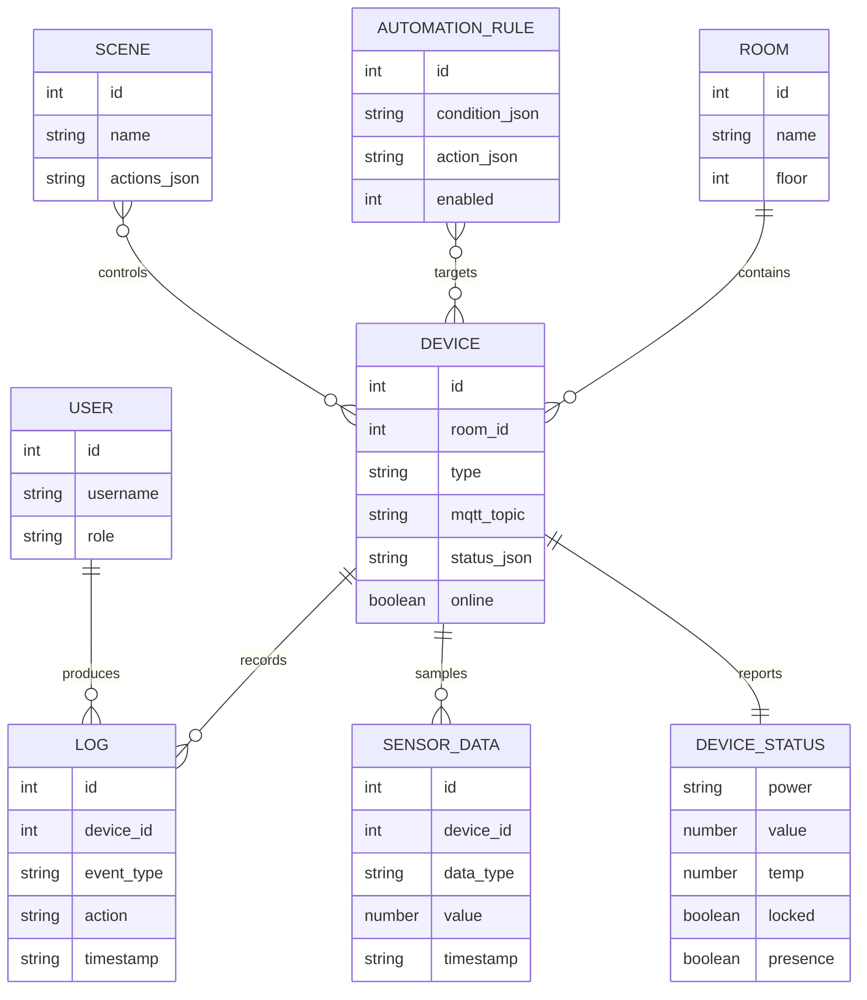

# 智能家居控制系统项目文档

_OpenHarmony API 20 单模块智能家居客户端的架构、接口、构建、运维与风险说明。分析基线：2026-07-30 当前工作区。_

---

## 目录

- [项目概览](#项目概览)
- [功能范围](#功能范围)
- [技术栈与工程状态](#技术栈与工程状态)
- [系统架构](#系统架构)
- [目录与模块](#目录与模块)
- [页面与用户流程](#页面与用户流程)
- [核心运行链路](#核心运行链路)
- [数据模型](#数据模型)
- [设备协议](#设备协议)
- [后端 API 契约](#后端-api-契约)
- [配置与安全](#配置与安全)
- [桌面卡片](#桌面卡片)
- [构建、安装与运行](#构建安装与运行)
- [测试与质量](#测试与质量)
- [故障排查](#故障排查)
- [已知问题与改进路线](#已知问题与改进路线)
- [维护指南](#维护指南)

---

## 项目概览

本项目是一个面向 OpenHarmony 默认设备类型的智能家居控制客户端，应用名为“智能家居”，包名为 `com.smarthome.a9`，当前版本为 `1.0.0`。客户端提供账户、全屋总览、设备发现与绑定、设备遥控、场景、自动化规则、数据监测、操作日志及桌面卡片能力。

项目只包含 OpenHarmony 客户端。业务数据、用户认证、房间与设备管理、场景执行、规则执行、设备发现及 MQTT 接入均依赖仓库外的后端服务。因此，单独编译 HAP 可以成功，但没有兼容后端时无法完成业务闭环。

### 当前能力边界

| 维度 | 当前实现 |
| --- | --- |
| 应用形态 | Stage 模型单 `entry` HAP |
| 系统版本 | `compileSdkVersion`、`targetSdkVersion`、`compatibleSdkVersion` 均为 20 |
| 页面 | 8 个路由页面，另有 1 个桌面卡片页面 |
| 网络 | REST/HTTP + WebSocket；后端内部再与 MQTT 设备通信 |
| 认证 | JWT Bearer Token；Token 负载中读取 `aes_key` |
| 本地状态 | Preferences 保存 Token、AES Key、服务器地址 |
| 外部依赖 | `oh-package.json5` 未声明第三方依赖 |
| 测试 | 当前未发现单元测试、组件测试或 `ohosTest` |
| 构建产物 | 已存在 signed/unsigned HAP，最近一次记录构建成功 |

### 仓库规模

| 项目 | 数量 |
| --- | ---: |
| `entry/src/main` 下源码与资源文件 | 31 |
| ArkTS 文件 | 22 |
| ArkTS 代码行 | 约 6556 |
| 已登记路由页面 | 8 |
| 截图 | 10 |
| 主业务模块 | 1 个 `entry` 模块 |

---

## 功能范围

### 用户与会话

- 用户名和密码登录。
- 新用户注册，客户端要求密码至少 6 位并进行二次确认。
- 启动时恢复本地 Token；存在 Token 时直接进入首页。
- 查看当前用户编号、用户名和角色。
- 修改密码与退出登录。

### 全屋总览

- 获取房间、设备、场景、最近日志和聚合统计。
- 按房间筛选设备。
- 展示温度、湿度、设备在线数和离线数。
- 快速进入设备管理、自动化、数据监测和个人中心。
- 执行场景；对离家、安防、门锁等敏感场景增加二次确认。
- 通过 WebSocket 合并设备实时状态，并重新计算在线数量和环境数据。

### 设备管理与控制

- 扫描后端发现的候选设备。
- 将候选设备绑定到房间，并可指定显示名称。
- 修改已绑定设备的名称和品牌。
- 删除设备。
- 控制灯光、空调、门锁、窗帘和加湿器。
- 设备控制页每 5 秒刷新当前房间的温湿度环境信息。
- 滑块命令有 250 ms 防抖，降低连续控制请求数量。
- 门锁解锁后在客户端执行 5 秒自动回锁倒计时。

### 自动化与监测

- 从后端动态获取规则触发器、运算符、目标设备和可执行动作。
- 创建、启用/停用和删除自动化规则。
- 支持温度、湿度和人体存在状态条件。
- 查看传感器实时值、24 小时/7 天历史数据和操作日志。
- 对温度高于 28°C、湿度低于 40% 的历史数据给出本地提示。

### 桌面卡片

- 支持 `2*2`、`2*4` 两种尺寸。
- 展示温度、湿度、灯光、空调、门锁、窗帘和加湿器状态。
- 支持点击刷新、系统定时更新和卡片可见性通知。

---

## 技术栈与工程状态

| 层次 | 技术/配置 | 说明 |
| --- | --- | --- |
| 开发语言 | ArkTS/ETS | 声明式 UI 与业务逻辑位于同一页面组件中 |
| UI 框架 | ArkUI | `@Entry`、`@Component`、`@State`、`@Builder` |
| 应用模型 | Stage 模型 | `UIAbility` + `FormExtensionAbility` |
| 构建系统 | Hvigor 6.22.3 | `modelVersion: 6.0.2` |
| SDK | OpenHarmony API 20 | 编译、目标和最低兼容 API 均为 20 |
| HTTP | `@ohos.net.http` | JSON REST 请求，10 秒连接和读取超时 |
| 实时通道 | `@ohos.net.webSocket` | `/ws/realtime?token=...`，5 秒重连 |
| 加密 | `@ohos.security.cryptoFramework` | AES-256-CBC + PKCS7；用于控制指令封装 |
| 持久化 | `@ohos.data.preferences` | 保存认证数据与服务器 URL |
| 日志 | `@ohos.hilog`、`console` | Ability、卡片和网络层分散记录 |
| 桌面卡片 | FormExtensionAbility | `EntryFormAbility` + `WidgetCard` |

构建日志 `build-api20-final.log` 记录了 Node.js `v24.11.1`、Hvigor `6.22.3` 和一次耗时约 12 秒的成功构建。Node.js 版本来自当时的 DevEco Studio/Hvigor 运行环境，不应理解为应用代码显式锁定的版本。

---

## 系统架构

### 总体架构



### 分层职责

| 层 | 主要文件 | 职责 |
| --- | --- | --- |
| 应用入口 | `EntryAbility.ets` | 初始化 Preferences，加载登录页 |
| 页面层 | `pages/*.ets` | 路由页面、状态管理、输入校验、交互与展示 |
| 通用 UI | `ControlCenterKit.ets`、`ControlCenterTheme.ets` | 底部导航、状态条、指标块与设计令牌 |
| API 层 | `ApiClient.ets` | REST 请求、认证头、DTO 映射、错误本地化、命令加密 |
| 实时层 | `MqttClient.ets` | WebSocket 连接、消息回调和断线重连 |
| 安全与存储 | `SecureStorage.ets`、`TokenUtil.ets`、`CryptoUtil.ets` | Token/URL 持久化、JWT 负载解析、AES 指令加密 |
| 模型层 | `DeviceModel.ets` | 用户、房间、设备、状态、规则、场景、日志等模型 |
| 卡片层 | `EntryFormAbility.ets`、`WidgetCard.ets` | 拉取设备状态、更新 Form 数据、渲染桌面卡片 |
| 资源与清单 | `module.json5`、`resources/**` | Ability、权限、路由、卡片和文案资源声明 |

### 关键架构特征

1. **页面直接调用 API 层。** 项目没有 Repository、Service 或状态容器层，页面同时负责业务编排和展示。
2. **后端是系统核心。** 客户端不直连 MQTT Broker；`MqttClient` 名称容易误导，它实际连接的是后端 WebSocket 网关。
3. **REST 是权威状态源。** WebSocket 只在首页增量更新内存状态；设备控制完成后仍会重新请求 REST 数据。
4. **桌面卡片独立取数。** 卡片不复用 `ApiClient.request`，而是直接匿名请求 `/api/devices`。

---

## 目录与模块

```text
openharmony/
|-- AppScope/
|   |-- app.json5                         # 包名、版本、图标和应用标签
|   `-- resources/base/                   # 应用级字符串与图标
|-- entry/
|   |-- build-profile.json5               # entry 目标配置
|   |-- hvigorfile.ts                     # HAP 构建任务
|   |-- oh-package.json5                  # entry 包元数据
|   |-- src/main/
|   |   |-- module.json5                  # Ability、Form、权限与页面声明
|   |   |-- syscap.json                   # 系统能力裁剪配置
|   |   |-- ets/
|   |   |   |-- Index.ets                 # 导出 EntryAbility
|   |   |   |-- entryability/             # 主窗口生命周期
|   |   |   |-- entryformability/         # 桌面卡片生命周期
|   |   |   |-- common/                   # API、实时通信、存储、加密、主题
|   |   |   |-- model/                    # 领域模型与状态解析
|   |   |   |-- pages/                    # 8 个业务页面
|   |   |   `-- widget/pages/             # 卡片 UI
|   |   `-- resources/
|   |       |-- base/profile/             # 页面和卡片清单
|   |       `-- rawfile/                   # 网络安全配置
|   `-- build/default/outputs/default/     # signed/unsigned HAP 与 sourcemap
|-- hvigor/hvigor-config.json5             # Hvigor 模型配置
|-- screenshots/                           # 设备实拍截图，含安装图标和登录流程
|-- build-profile.json5                    # SDK、产品、模块与签名配置
|-- local.properties                       # 本机 SDK 路径，不应进入版本控制
|-- oh-package.json5                       # 根包元数据
`-- hvigorw.bat / hvigorw.js               # Windows 构建包装器
```

### 核心文件说明

| 文件 | 作用 | 维护注意点 |
| --- | --- | --- |
| `entry/src/main/ets/common/ApiClient.ets` | 20 余个 API 方法与 DTO 映射 | 约 784 行，是网络契约的集中点 |
| `entry/src/main/ets/model/DeviceModel.ets` | 领域模型和 `parseDeviceStatus` | 新增设备字段时需同步解析函数 |
| `entry/src/main/ets/pages/DashboardPage.ets` | 首页、场景、实时消息合并 | 约 1273 行，职责较多 |
| `entry/src/main/ets/pages/DeviceRemotePage.ets` | 五类设备控制面板 | 约 1017 行，按 `deviceType` 分支 |
| `entry/src/main/ets/pages/RulesPage.ets` | 规则 CRUD 和动态规则表单 | JSON 条件/动作结构依赖后端契约 |
| `entry/src/main/ets/pages/DataMonitorPage.ets` | 实时、历史和日志三个视图 | 历史数据仅列表展示，无图表 |
| `entry/src/main/ets/common/MqttClient.ets` | 实时 WebSocket | 单例连接、单组回调、5 秒重连 |
| `entry/src/main/ets/entryformability/EntryFormAbility.ets` | 卡片取数与刷新 | 未复用认证请求逻辑 |

---

## 页面与用户流程

### 路由清单

路由由 `entry/src/main/resources/base/profile/main_pages.json` 登记：

| 路由 | 页面 | 主要功能 | 入口 |
| --- | --- | --- | --- |
| `pages/LoginPage` | 登录页 | 恢复会话、登录、进入注册 | Ability 默认入口 |
| `pages/RegisterPage` | 注册页 | 创建普通用户账户 | 登录页 |
| `pages/DashboardPage` | 全屋首页 | 总览、场景、房间、设备、实时消息 | 登录/注册成功 |
| `pages/DeviceManagePage` | 设备管理 | 列表、发现、绑定、编辑、删除 | 首页或底部导航 |
| `pages/DeviceRemotePage` | 设备遥控 | 灯、空调、门锁、窗帘、加湿器 | 首页设备卡片 |
| `pages/RulesPage` | 自动化 | 规则列表、筛选、创建、开关、删除 | 首页或底部导航 |
| `pages/DataMonitorPage` | 数据监测 | 实时数据、历史采样、运行日志 | 首页快捷入口 |
| `pages/ProfilePage` | 个人中心 | 用户信息、改密、退出 | 首页或底部导航 |

### 页面导航



### 页面状态管理

各页面使用局部 `@State`，没有跨页面全局状态容器。路由参数只在设备遥控页使用：

```ts
{
  deviceType: "light",
  deviceId: 12
}
```

底部导航使用 `replaceUrl`，详情页通常使用 `pushUrl`/`back`。登录和退出也使用 `replaceUrl`，避免返回到无效的认证页面。

---

## 核心运行链路

### 启动与认证



注册流程使用 `POST /api/auth/register`，客户端固定提交 `role: "user"`。登录和注册成功后都会持久化 Token，并直接进入首页。

### 首页加载与实时更新

1. `DashboardPage.aboutToAppear()` 并行触发 REST 加载和 WebSocket 连接。
2. `GET /api/dashboard/summary` 返回房间、设备、场景、日志和统计。
3. WebSocket 连接 `/ws/realtime?token=<jwt>`。
4. 首页只处理 `type === "mqtt"` 的消息。
5. Topic 必须匹配 `home/<room>/<device>/<status|sensor|response>`。
6. 客户端以前三段作为设备 `mqtt_topic`，过滤 `device_id`、`brand_command`、`success`、`ts` 后合并状态。
7. 实时消息会将匹配设备标为在线，并刷新温湿度和在线计数。

### 设备控制



当 JWT 中不含 `aes_key` 时，`callService` 会发送明文 `action` 和 `params`。有 AES Key 时，请求体会改写为：

```json
{
  "entity_id": "light.device_12",
  "action": "encrypted",
  "params": {
    "encrypted": "<base64(iv + ciphertext)>"
  }
}
```

### 自动化规则

规则由条件 JSON 和动作 JSON 组成，字段名与后端强耦合。

```json
{
  "trigger": "temperature_sensor",
  "field": "value",
  "operator": "gt",
  "value": 28
}
```

```json
[
  {
    "device_id": 12,
    "device_type": "ac",
    "room_id": "livingroom",
    "action": "set",
    "params": {
      "power": "on",
      "mode": "cool",
      "temp": 26
    }
  }
]
```

触发器、运算符和目标设备来自 `/api/rules/options`。人体传感器只允许 `eq`/`neq`，其他传感器值必须是数字。

---

## 数据模型

### 主要模型

| 模型 | 核心字段 | 用途 |
| --- | --- | --- |
| `UserInfo` | `id`、`username`、`role` | 当前用户 |
| `LoginResponse` | `token`、`user` | 登录/注册响应 |
| `Room` | `id`、`name`、`floor`、`device_count` | 房间和设备分组 |
| `Device` | `id`、`room_id`、`type`、`mqtt_topic`、`status_json`、`online` | 设备主模型 |
| `DeviceStatus` | 电源、亮度、温度、门锁、存在、窗帘、湿度、能耗字段 | 统一状态视图 |
| `HAEntityState` | `entity_id`、`state`、`attributes`、更新时间 | 服务调用和状态接口 |
| `Scene` | `id`、`name`、`description`、`actions_json` | 场景 |
| `AutomationRule` | `condition_json`、`action_json`、`enabled` | 自动化规则 |
| `RuleOptions` | `triggers`、`operators`、`actions`、`targets` | 动态规则表单选项 |
| `SensorDataItem` | `device_id`、`data_type`、`value`、`timestamp` | 历史遥测 |
| `LogItem` | `event_type`、`action`、`detail`、`source` | 操作和场景日志 |
| `DashboardSummary` | `rooms`、`devices`、`scenes`、`recent_logs`、`stats` | 首页聚合响应 |

### 设备关系



`status_json` 是字符串化 JSON。`parseDeviceStatus()` 解析已知字段，解析失败时返回所有字段为默认值的 `DeviceStatus`，不会向调用者抛错。

---

## 设备协议

### 支持的设备类型

| `type` | 中文名称 | 主要状态字段 | 客户端动作 | 控制页 |
| --- | --- | --- | --- | --- |
| `light` | 灯光 | `power`、`brightness`、`color` | `on`、`off`、`set` | 有 |
| `ac` | 空调 | `power`、`temp`、`mode`、`fan`、`swing`、`brand` | `on`、`off`、`set` | 有 |
| `door_lock` | 门锁 | `locked` | `unlock`、`lock` | 有 |
| `curtain` | 窗帘 | `position` | `open`、`close`、`set` | 有 |
| `humidifier` | 加湿器 | `power`、`level`、`target_humidity` | `on`、`off`、`set` | 有 |
| `temperature_sensor` | 温度传感器 | `value`、`unit` | 只读 | 无 |
| `humidity_sensor` | 湿度传感器 | `value`、`unit` | 只读 | 无 |
| `pir_sensor` | 人体传感器 | `presence` | 只读 | 无 |

模型还支持 `power_watts` 和 `total_kwh`，但当前页面和设备类型列表没有独立的电表设备类型。

### 实体和 Topic 规则

- 服务实体 ID：`<device_type>.device_<device_id>`，例如 `light.device_12`。
- 设备基础 Topic：`home/<room>/<device>`。
- 实时状态 Topic：`home/<room>/<device>/status`。
- 传感器 Topic：`home/<room>/<device>/sensor`。
- 命令响应 Topic：`home/<room>/<device>/response`，有效状态位于 `payload.state`。

### 常用命令参数

| 设备 | 示例参数 |
| --- | --- |
| 灯光开启 | `{ "brightness": 80, "color": "warm" }` |
| 灯光调节 | `{ "brightness": 60 }` |
| 空调开启 | `{ "mode": "cool", "temp": 26, "fan": "auto" }` |
| 空调调温 | `{ "temp": 24 }` |
| 门锁解锁 | `{ "auth_code": "<encrypted-code>" }` |
| 窗帘定位 | `{ "position": 50 }` |
| 加湿器开启 | `{ "level": 2, "target_humidity": 60 }` |

---

## 后端 API 契约

### 通用约定

- 基础地址默认是 `http://8.162.10.179:8000`。
- 请求和响应均使用 JSON。
- 已登录请求使用 `Authorization: Bearer <token>`。
- 连接超时和读取超时均为 10 秒；卡片请求为 5 秒。
- 2xx 响应必须包含非空 JSON；空响应也会被视为错误。
- 非 2xx 响应优先读取 JSON 中的 `detail`，其次读取 `message`。
- 客户端只对 `POST` 和 `PUT` 附加请求体，不支持 `PATCH` 请求体。

### 端点总表

| 方法 | 路径 | 客户端方法 | 用途/关键参数 |
| --- | --- | --- | --- |
| `POST` | `/api/login` | `login` | `{ username, password }`，返回 Token 与用户 |
| `POST` | `/api/auth/register` | `register` | `{ username, password, role: "user" }` |
| `GET` | `/api/auth/me` | `getMe` | 当前用户 |
| `PUT` | `/api/auth/change-password` | `changePassword` | `{ old_password, new_password }` |
| `GET` | `/api/rooms` | `getRooms` | 房间列表 |
| `GET` | `/api/rooms/{id}` | `getRoom` | 单个房间 |
| `GET` | `/api/states` | `getStates` | HA 风格实体状态 |
| `GET` | `/api/devices` | `getDevices` | 可选 `room_id`、`type` |
| `POST` | `/api/devices` | `createDevice` | 房间、类型、名称、品牌、Topic；当前 UI 未调用 |
| `GET` | `/api/devices/{id}` | `getDevice` | 单个设备 |
| `PUT` | `/api/devices/{id}` | `updateDeviceName` | 修改名称与品牌 |
| `DELETE` | `/api/devices/{id}` | `deleteDevice` | 删除设备 |
| `POST` | `/api/services` | `callService` | 设备控制，支持加密封装 |
| `POST` | `/api/discovery` | `discoverDevices` | 返回 `{ discovered: [...] }` |
| `POST` | `/api/bind_device` | `bindDevice` | `{ device_id, room_id, name? }` |
| `GET` | `/api/rules` | `getRules` | 规则列表 |
| `GET` | `/api/rules/options` | `getRuleOptions` | 动态规则选项 |
| `POST` | `/api/rules` | `createRule` | 名称、条件 JSON、动作 JSON、`enabled: 1` |
| `POST` | `/api/rules/{id}/toggle` | `toggleRule` | 切换启用状态 |
| `DELETE` | `/api/rules/{id}` | `deleteRule` | 删除规则 |
| `GET` | `/api/scenes` | `getScenes` | 场景列表；当前页面主要使用聚合接口中的场景 |
| `POST` | `/api/scenes/{id}/execute` | `executeScene` | 执行场景 |
| `GET` | `/api/dashboard/summary` | `getDashboardSummary` | 首页聚合数据 |
| `GET` | `/api/data/sensors` | `getSensorHistory` | `limit`、`device_id`、`start`、`end` |
| `GET` | `/api/data/logs` | `getDeviceLogs` | `limit`、`device_id` |
| `GET` | `/ws/realtime?token=...` | `connectWS` | WebSocket 实时消息 |

### 关键响应结构

`GET /api/dashboard/summary`：

```json
{
  "rooms": [],
  "devices": [],
  "scenes": [],
  "recent_logs": [],
  "stats": {
    "total_devices": 0,
    "online_devices": 0,
    "offline_devices": 0,
    "total_rooms": 0,
    "total_scenes": 0
  }
}
```

WebSocket 消息：

```json
{
  "type": "mqtt",
  "topic": "home/living-room/light-01/status",
  "payload": {
    "power": "on",
    "brightness": 80,
    "ts": 1785400000
  }
}
```

规则选项：

```json
{
  "triggers": [
    {
      "label": "温度传感器",
      "value": "temperature_sensor",
      "field": "value",
      "room_name": "客厅"
    }
  ],
  "operators": [
    { "label": "大于", "value": "gt" }
  ],
  "actions": {
    "ac": ["on", "off", "set"]
  },
  "targets": [
    {
      "device_id": 12,
      "label": "客厅空调",
      "type": "ac",
      "room_name": "客厅",
      "actions": ["on", "off", "set"]
    }
  ]
}
```

---

## 配置与安全

### 应用配置

| 配置 | 位置 | 当前值/行为 |
| --- | --- | --- |
| 包名 | `AppScope/app.json5` | `com.smarthome.a9` |
| 版本 | `AppScope/app.json5` | `1.0.0` / `1000000` |
| SDK | `build-profile.json5` | API 20 |
| 运行系统 | `build-profile.json5` | `OpenHarmony` |
| 主模块 | `build-profile.json5` | `entry` |
| 默认页面 | `EntryAbility.ets` | `pages/LoginPage` |
| 网络权限 | `entry/src/main/module.json5` | `ohos.permission.INTERNET` |
| 默认服务器 | `SecureStorage.ets` | `http://8.162.10.179:8000` |
| 本地偏好文件 | `SecureStorage.ets` | `smart_home_auth` |
| WebSocket 重连 | `MqttClient.ets` | 每 5 秒 |
| 卡片刷新 | `form_config.json` / Form Ability | 系统计划 + 应用内每 60 秒 |

`setBaseUrl()` 可以保存服务器地址，但当前页面没有调用它。因此源码中的默认地址实际上是普通用户唯一可用的服务器地址；`screenshots/` 中出现的“服务器配置”入口属于历史界面，当前页面代码中不存在。

### 网络安全配置

`network_security_config.xml` 允许全局明文流量，并信任系统证书和用户证书；同时显式列出公网默认服务器、`localhost` 和多个局域网 IP。当前默认 REST 使用 `http://`，实时通道对应 `ws://`。

### 高优先级安全问题

| 等级 | 问题 | 影响 | 建议 |
| --- | --- | --- | --- |
| 严重 | `build-profile.json5` 含本机签名文件路径和明文口令 | 凭据泄露，可移植性差 | 立即轮换现有材料；移出仓库，使用 DevEco/CI 密钥管理和本地忽略文件 |
| 高 | 全局允许明文 HTTP，默认服务器也是 HTTP | Token、设备状态和控制指令可被窃听或篡改 | 后端启用 HTTPS/WSS；生产构建禁止 cleartext |
| 高 | JWT 通过 WebSocket 查询参数传输 | URL 可能进入代理、网关或诊断日志 | 使用受支持的认证头、一次性票据或首帧认证 |
| 高 | Token 与 AES Key 存入普通 Preferences | 设备侧认证材料保护不足 | 使用 OpenHarmony HUKS/安全存储，避免重复保存派生密钥 |
| 高 | AES-CBC 不提供完整性认证 | 密文可能被篡改而无法检测 | 改用 AES-GCM，并使用独立密钥版本和重放保护 |
| 高 | 随机数失败时退化为全零 IV；门锁验证码可退化为明文/演示值 | 安全失败被静默降级 | 安全操作必须失败关闭，禁止任何明文或固定值回退 |
| 中 | 客户端直接信任 JWT 负载中的 `aes_key`，不验证签名 | 本地逻辑可使用伪造负载 | 密钥协商和授权应由可信后端/系统密钥设施完成 |
| 中 | 桌面卡片匿名请求 `/api/devices` | 若端点要求认证则卡片永远回退默认值；若不要求则可能泄露状态 | 为 Form 安全读取凭据并复用 API 层，或提供最小权限卡片接口 |

### 其他配置风险

- `local.properties` 包含本机 SDK 路径，文件头也明确说明不应纳入版本控制。
- 当前仓库没有 `.gitignore`，但已经包含 `entry/build`、`.hvigor`、`.idea`、本地属性和大体积日志。
- `clearAuthData()` 调用 `prefs.clear()`，退出登录会连同已保存服务器 URL 一并删除。
- 服务器地址的 `setBaseUrl()` 异步保存未被等待，应用立即退出时可能丢失更新。

---

## 桌面卡片

### 声明

卡片名为 `widget`，默认尺寸 `2*2`，还支持 `2*4`。它支持系统更新、每日 `10:30` 计划更新、应用内 60 秒循环更新、显隐通知和手动刷新消息。

### 数据映射

`EntryFormAbility.fetchDeviceData()` 请求 `/api/devices`，遍历所有设备并使用同类型最后一次遍历到的状态：

| 卡片字段 | 来源 |
| --- | --- |
| `temperature` | `temperature_sensor.status_json.value` |
| `humidity` | `humidity_sensor.status_json.value` |
| `lightOn` | 任一灯光 `power === "on"` 时设为真 |
| `acOn` | 任一空调 `power === "on"` 时设为真 |
| `locked` | 门锁 `locked` |
| `curtainOpen` | 窗帘 `position > 0` |
| `humidifierOn` | 加湿器 `power === "on"` |
| `updateTime` | 本次成功刷新时的本地时分 |

请求或解析失败时，卡片返回 `--`、关闭和已上锁等安全默认值，并记录 Hilog 错误。

---

## 构建、安装与运行

### 前置条件

| 工具 | 要求 |
| --- | --- |
| DevEco Studio | 能管理 OpenHarmony API 20 SDK 的版本 |
| OpenHarmony SDK | API 20，路径写入 `local.properties` 或 `OHOS_BASE_SDK_HOME` |
| Hvigor | 项目包装器当前解析为 6.22.3 |
| 设备/模拟器 | 支持 API 20 的默认设备类型 |
| 后端 | 实现本文列出的 REST 和 WebSocket 契约 |
| 签名 | 为当前开发机或 CI 单独创建，不能复用仓库中暴露的材料 |

### 首次配置

1. 使用 DevEco Studio 打开仓库根目录。
2. 安装 OpenHarmony API 20 SDK。
3. 让 DevEco Studio 生成本机 `local.properties`，或手动配置：

```properties
sdk.dir=C:/path/to/OpenHarmony/Sdk
```

4. 在 DevEco Studio 项目结构中重新创建本机调试签名。
5. 将 `SecureStorage.ets` 中的默认服务器替换为可用后端，或先实现一个调用 `setBaseUrl()` 的设置入口。

### 命令行构建

PowerShell：

```powershell
.\hvigorw.bat assembleHap --stacktrace
```

成功标志：

```text
BUILD SUCCESSFUL
```

主要产物：

| 产物 | 用途 |
| --- | --- |
| `entry/build/default/outputs/default/entry-default-signed.hap` | 已签名调试安装包 |
| `entry/build/default/outputs/default/entry-default-unsigned.hap` | 未签名安装包 |
| `entry/build/default/outputs/default/mapping/sourceMaps.map` | ArkTS Source Map |
| `entry/build/default/outputs/default/pack.info` | 包摘要与 API/Ability 信息 |

当前工作区现有 signed HAP 约 1.33 MB，unsigned HAP 约 1.27 MB；这些是生成物，不应作为源码的一部分长期维护。

### 安装与启动

推荐直接在 DevEco Studio 选择 API 20 设备并运行 `entry`。使用 HDC 时，可在已连接设备上安装已签名 HAP：

```powershell
hdc install entry\build\default\outputs\default\entry-default-signed.hap
```

安装后应用从 `EntryAbility` 启动并加载登录页。首次业务验证至少应覆盖：

1. 注册或登录成功。
2. 首页聚合数据加载成功。
3. WebSocket 显示在线并能收到状态更新。
4. 绑定一台候选设备。
5. 对每类可控设备执行至少一个命令。
6. 创建并触发一条自动化规则。
7. 查看历史数据和日志。
8. 添加桌面卡片并手动刷新。

---

## 测试与质量

### 当前验证证据

| 项目 | 状态 | 依据 |
| --- | --- | --- |
| ArkTS 编译 | 通过 | `build-api20-final.log` 中 `CompileArkTS` 完成 |
| 资源编译 | 通过 | `CompileResource` 完成 |
| HAP 打包 | 通过 | `PackageHap` 生成 unsigned HAP |
| HAP 签名 | 通过 | `SignHap` 生成 signed HAP |
| 完整构建 | 通过 | 两份 API 20 日志均记录 `BUILD SUCCESSFUL` |
| 自动化测试 | 缺失 | 未发现 `test`、`ohosTest`、`.spec` 或 `.test` 文件 |
| 后端联调 | 无可重复脚本 | 仓库不包含后端、Mock Server 或 API Schema |
| UI 回归 | 有历史截图 | `screenshots/` 含 10 张设备截图，但登录界面与当前源码样式不完全一致 |

### 建议测试分层

1. **纯函数单测**：`parseDeviceStatus`、JWT Base64URL 解码、错误映射、Topic 规范化、规则 JSON 生成。
2. **API 契约测试**：为所有 DTO 映射提供固定 JSON；校验空字段、类型错误和非 2xx 响应。
3. **组件测试**：登录校验、规则动态选项、设备控制状态、空态和错误态。
4. **集成测试**：Mock REST/WebSocket，覆盖登录、首页实时更新、控制命令和重连。
5. **设备测试**：API 20 真机/模拟器安装、前后台切换、断网恢复、桌面卡片生命周期。
6. **安全测试**：明文流量检测、Token 泄露面、重放、篡改、随机数失败和本地数据提取。

### 最小发布门槛

- `assembleHap` 在干净环境成功。
- 不含签名口令、私钥、本机 SDK 路径和真实 Token。
- API 契约测试覆盖所有公开客户端方法。
- WebSocket 离开首页后不再重连。
- HTTPS/WSS 强制启用，生产网络配置禁止明文。
- 门锁加密失败时阻止解锁，且不存在演示验证码回退。
- 桌面卡片在认证接口下能稳定更新。

---

## 故障排查

### 找不到 SDK

典型错误：

```text
Unable to find 'sdk.dir' in 'local.properties' or 'OHOS_BASE_SDK_HOME'
```

处理步骤：

1. 确认 API 20 SDK 已安装。
2. 修改 `local.properties` 中 `sdk.dir` 为当前机器的真实路径。
3. 或设置 `OHOS_BASE_SDK_HOME`。
4. 停止旧守护进程后重试：

```powershell
.\hvigorw.bat --stop-daemon
.\hvigorw.bat assembleHap --stacktrace
```

### 连接被拒绝或请求超时

1. 检查默认服务器 `8.162.10.179:8000` 是否可达。
2. 确认设备网络允许访问对应地址和端口。
3. 确认后端实现的是 `/api/login`，不是常见但不同的 `/api/auth/login`。
4. 若改用 HTTPS，确认证书链能被设备信任。
5. 检查 `network_security_config.xml` 是否随当前构建生效。

### 登录后立即回到登录页

- 检查返回 JSON 是否包含非空 `token`。
- 检查 Preferences 是否已成功初始化。
- 检查后端 Token 是否满足三段式 JWT 格式；否则无法提取 AES Key，但基础登录仍可能成功。
- 检查 `/api/dashboard/summary` 是否接受该 Token。

### 首页无实时数据

- 确认 WebSocket 地址是 `/ws/realtime?token=<jwt>`。
- 确认服务发送文本帧，而不是二进制帧。
- 确认消息 `type` 为 `mqtt`。
- 确认 Topic 至少有四段，且前缀为 `home`。
- 确认设备的 `mqtt_topic` 等于 Topic 的前三段。
- 确认后缀为 `status`、`sensor` 或 `response`。

### 控制成功但页面状态未更新

- 检查 `/api/services` 是否返回 `success` 和可选的 `changed_states`。
- 检查随后 `/api/devices` 是否已反映新状态。
- 检查 `status_json` 是字符串化 JSON，而不是直接对象。
- 检查设备 `type` 是否与实体 ID 前缀一致。

### 桌面卡片一直显示默认值

- 卡片当前不发送 Bearer Token，先确认 `/api/devices` 是否允许匿名读取。
- 检查 Form Ability 是否能初始化 Preferences。
- 检查卡片网络请求的 5 秒超时。
- 查看 `SmartHomeForm` 标签的 Hilog。
- 检查返回是否为数组，且每项包含 `type` 与字符串 `status_json`。

### 构建出现 Cangjie 支持模块警告

现有成功日志中出现 `@ohos/cangjie-build-support/index` 缺失的 DEBUG 信息，但项目没有 Cangjie 源码，后续 ArkTS 编译和 HAP 打包仍成功。只要最终结果是 `BUILD SUCCESSFUL`，该条当前可视为工具链调试噪声；若升级 DevEco 后转为 ERROR，再修复 SDK/插件安装。

---

## 已知问题与改进路线

### P0：发布前必须处理

1. **撤销并轮换签名凭据。** 当前 `build-profile.json5` 暴露签名口令和本机材料路径。
2. **强制 TLS。** REST 与 WebSocket 改为 HTTPS/WSS，生产网络配置禁止全局明文。
3. **重做门锁安全链路。** 使用认证加密、服务器挑战、时效和防重放；删除零 IV、明文和演示值回退。
4. **保护本地密钥。** 迁移到 HUKS 或等价安全存储。

### P1：稳定性与正确性

1. **修复 WebSocket 主动断开后的重连。** `disconnectWS()` 调用 `close()` 后，`close` 事件仍可能再次启动重连定时器；应增加 `shouldReconnect` 标志并在主动关闭时禁用。
2. **拆分认证与服务器设置。** 退出登录只清除 Token/AES Key，不应删除服务器 URL。
3. **统一卡片请求。** Form Ability 应复用认证、错误处理、DTO 映射和服务器配置。
4. **提供服务器配置 UI。** 当前 `setBaseUrl()` 无调用点，部署环境只能改代码或预置 Preferences。
5. **区分无数据与数值 0。** `roomSensorValue()` 使用 `value > 0` 判断可用性，会把合法的 `0°C`/`0%` 当作未采集。
6. **完善 WebSocket 错误恢复。** `error` 事件本身不安排重连，依赖随后一定触发 `close`。
7. **为 Preferences 初始化失败增加重试。** 当前初始化 Promise 一旦失败仍保持已完成状态。

### P2：可维护性与体验

1. 将 `DashboardPage`、`DeviceRemotePage`、`RulesPage` 拆成按业务域组织的组件和状态控制器。
2. 将 `ld`、`ds`、`dT`、`dD`、`dC`、`sl`、`clr` 等缩写重命名为表达业务含义的方法。
3. 把页面重复的 `localizeMessage`、错误条、加载态和卡片样式收敛到公共模块。
4. 引入 OpenAPI 或 JSON Schema，生成/校验 API DTO，减少 `Record<string, Object>` 强制断言。
5. 用折线图展示传感器历史，而不是只有倒序列表。
6. 为设备删除、门锁解锁和高风险规则增加统一确认对话框。
7. 更新 `screenshots/`，使图片与当前绿色主题和页面结构保持一致。
8. 增加 README 更新检查和接口契约变更记录。

### P3：仓库治理

建议新增 `.gitignore`，至少忽略：

```gitignore
.hvigor/
.idea/
.appanalyzer/
.pytest_cache/
.sdk-proxy/
entry/build/
local.properties
*.log
```

同时补充许可证正文、贡献指南、后端仓库地址、API 版本策略和发布流程。根包声明 `Apache-2.0`，但当前目录未发现独立 `LICENSE` 文件。

---

## 维护指南

### 新增设备类型

新增设备类型至少需要同步修改：

1. `DeviceModel.ets`：为 `DeviceStatus`/`CommandParams` 增加状态和控制字段。
2. `parseDeviceStatus()`：安全解析新字段。
3. `DeviceManagePage.ets`：加入设备类型名称和图标。
4. `DashboardPage.ets`：加入状态摘要、图标、颜色和控制页导航。
5. `DeviceRemotePage.ets`：增加状态装载、主指标、控制面板和命令参数。
6. `RulesPage.ets`：加入动作标签和 `set` 参数构造。
7. `DataMonitorPage.ets`：若为传感器，增加单位、图标和洞察规则。
8. `EntryFormAbility.ets` / `WidgetCard.ets`：如需卡片展示，增加绑定数据字段。
9. 后端：补齐发现、绑定、状态、服务调用、规则选项和 MQTT 映射。
10. 测试：覆盖状态解析、命令体、实时 Topic 和 UI 状态。

### 修改 API 契约

1. 先更新后端 API Schema 和兼容策略。
2. 修改 `ApiClient.ets` 中请求路径、请求体和映射函数。
3. 修改 `DeviceModel.ets` 中对应模型。
4. 检查首页聚合接口、卡片匿名接口和 WebSocket 消息是否受影响。
5. 增加旧版/新版响应的契约测试。
6. 更新本文的端点表和 JSON 示例。

### 修改认证或加密

认证变更会同时影响 `ApiClient`、`TokenUtil`、`CryptoUtil`、`SecureStorage`、`MqttClient`、`EntryFormAbility` 和后端。应将迁移设计为一个整体版本，明确：

- Token 的传输位置、过期和刷新方式。
- 设备控制密钥的产生、保存、轮换和吊销。
- 加密算法、Nonce/IV、附加认证数据和防重放字段。
- 桌面卡片的最小权限认证方式。
- 老客户端与新后端的兼容窗口。

### 发布检查表

- [ ] 更新 `versionCode` 与 `versionName`。
- [ ] 使用目标环境服务器地址和 HTTPS/WSS。
- [ ] 确认仓库与产物不含调试凭据和本机路径。
- [ ] 运行完整自动化测试和 API 契约测试。
- [ ] 执行 `assembleHap` 并保存无敏感信息的构建摘要。
- [ ] 在 API 20 真机验证 8 个页面和桌面卡片。
- [ ] 验证断网、恢复、Token 过期和后端错误状态。
- [ ] 验证五类可控设备和三类传感器。
- [ ] 更新截图、接口文档和变更记录。

---

## 文档依据与限制

本文件由当前工作区的 ArkTS 源码、JSON5/JSON/XML 配置、Hvigor 输出、HAP 包摘要和截图静态分析生成。仓库不包含后端源码、数据库结构、MQTT Broker 配置、CI/CD 配置或可执行测试，因此关于这些外部系统的描述仅限于客户端代码能够证明的接口契约，不代表后端内部实现。

主要依据：

- `AppScope/app.json5`
- `build-profile.json5`
- `entry/src/main/module.json5`
- `entry/src/main/resources/base/profile/main_pages.json`
- `entry/src/main/resources/base/profile/form_config.json`
- `entry/src/main/resources/rawfile/network_security_config.xml`
- `entry/src/main/ets/common/*.ets`
- `entry/src/main/ets/model/DeviceModel.ets`
- `entry/src/main/ets/pages/*.ets`
- `entry/src/main/ets/entryability/EntryAbility.ets`
- `entry/src/main/ets/entryformability/EntryFormAbility.ets`
- `entry/src/main/ets/widget/pages/WidgetCard.ets`
- `build-api20-final.log`、`build-api20-verify.log`
- `entry/build/default/outputs/default/pack.info`

_最后更新：2026-07-30_
