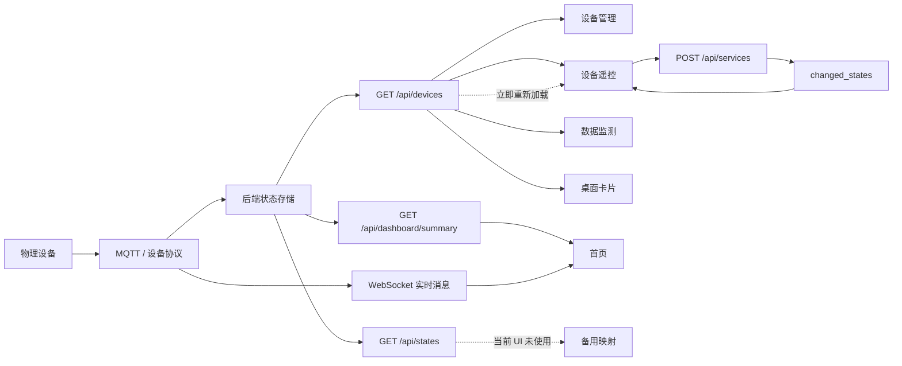

# 设备显示状态与实际状态一致性检查

_检查基线：`demo` 分支 `15e31df`，OpenHarmony API 20 模拟器，2026-07-30。_

> 本文中的“实际状态”指应用能够取得的最新服务端设备状态，不等同于物理设备真值。当前客户端没有设备侧回执校验、状态版本号或采集时间校验，因此仅凭现有代码无法证明 UI 与物理设备始终一致。

---

## 📋 检查结论

当前实现**不能完整保证设备显示状态与实际状态一致**。正常、字段完整且时序稳定时，多数设备能够正确显示；但在字段缺失、类型异常、设备离线、命令回写延迟或 WebSocket 消息乱序时，UI 会把“未知”显示成确定的“关闭、解锁、无人、0”，或被旧状态覆盖。

| 结论项 | 结果 |
|---|---|
| 已覆盖设备类型 | 8 类：灯光、空调、门锁、窗帘、加湿器、温度、湿度、人体传感器 |
| 已覆盖显示入口 | 首页、设备管理、设备遥控、数据监测、桌面卡片 |
| 模拟器当前设备样本 | 20 台已绑定设备，7 台在线，13 台离线 |
| 高风险问题 | 6 项 |
| 中风险问题 | 11 项 |
| 低风险问题 | 2 项 |
| 已修复问题 | 1 项：设备切换后操作按钮仍沿用上一台设备状态 |
| 总体判断 | 状态链路可用，但“未知状态处理”和“多数据源时序”存在逻辑缺口 |

最需要优先处理的是：

1. 状态字段缺失或 JSON 解析失败时，不得默认显示为“关闭、解锁、无人、0”。
2. 控制命令返回状态与随后 `/api/devices` 查询结果必须按设备 ID 和更新时间合并，避免新状态被旧数据覆盖。
3. 桌面卡片必须携带认证信息；当前请求没有 `Authorization`，后端要求 Bearer Token 时只能回落到默认值。
4. 离线设备的缓存业务状态必须明确标注“上次状态”和更新时间，不能呈现为当前实时状态。

## 🔄 状态数据链路

现有 UI 的主要数据源并不完全相同：

| 入口 | 首次数据源 | 增量数据源 | 状态文案来源 |
|---|---|---|---|
| 首页 | `/api/dashboard/summary` | WebSocket MQTT 消息 | 优先 `status_summary`，否则解析 `status_json` |
| 设备管理 | `/api/devices` | 无自动刷新 | `online` 与服务端 `status_summary` |
| 设备遥控 | `/api/devices` | 命令 `changed_states`，随后重新请求 `/api/devices` | 本地 `@State`，由 `status_json` 初始化 |
| 数据监测 | `/api/devices`、历史与日志接口 | 仅手动刷新 | 解析 `status_json` |
| 桌面卡片 | 未认证的 `/api/devices` | 60 秒轮询 | 自行解析 `status_json` |

虽然 [`ApiClient.ets`](../entry/src/main/ets/common/ApiClient.ets#L407) 提供 `/api/states` 和 `stateToDevice()`，但 [`getDevicesForUi()`](../entry/src/main/ets/common/ApiClient.ets#L505) 实际仍读取 `/api/devices`。因此 UI 没有用 `/api/states` 对 `/api/devices` 做交叉校验。

## 🌐 服务器读取逻辑

结论是：**主应用的设备数据确实从服务器获取，不是从本地固定数据或 Preferences 中读取。** Preferences 只保存 Token、AES Key 和服务器地址；页面状态保存在内存 `@State` 中，退出页面后重新进入会再次请求服务器。

当前服务器读取配置：

| 配置项 | 当前逻辑 | 检查结果 |
|---|---|---|
| 默认服务地址 | `http://8.162.10.179:8000` | 来自 [`SecureStorage.ets`](../entry/src/main/ets/common/SecureStorage.ets#L3) |
| 地址覆盖 | 优先读取 Preferences 中的 `server_url` | 工程内没有调用 `setBaseUrl()` 的设置页面，通常仍使用默认地址 |
| REST 认证 | `Authorization: Bearer <token>` | 主 API 客户端会添加；实时检查确认无 Token 的 `/api/devices` 返回 `401` |
| WebSocket 认证 | `/ws/realtime?token=<token>` | Token 放在查询参数中 |
| 当前服务健康 | `GET /api/health` | 2026-07-30 检查返回 `status: ok` |
| 客户端缓存层 | 无持久化设备缓存 | 请求失败时部分页面保留上一次内存数据 |
| 服务端实现 | 不在当前仓库 | 只能验证客户端调用契约，不能审查服务端如何生成 `online/status_json/status_summary` |

各页面每次读取的实际过程：

| 页面/功能 | 是否访问服务器 | 读取接口 | 刷新时机 | 本地二次处理 |
|---|---|---|---|---|
| 首页 | 是 | `GET /api/dashboard/summary` | 进入页面、手动刷新、场景执行后 | WebSocket 消息按 MQTT Topic 合并到 `status_json` |
| 设备管理 | 是 | `GET /api/devices`、`GET /api/rooms`、`POST /api/discovery` | 进入页面；编辑、删除、绑定后重新加载 | 在线设备优先显示服务端 `status_summary` |
| 设备遥控 | 是 | `GET /api/devices?type=...` | 进入页面、手动刷新、命令完成后 | 将 `status_json` 转为页面 `@State`；命令先应用 `changed_states` |
| 遥控页环境值 | 是 | `GET /api/devices?room_id=...` | 每 5 秒 | 只更新同房间传感器，不更新当前受控设备 |
| 数据监测实时页 | 是 | `GET /api/devices` | 进入页面、点击刷新 | 客户端用 `type` 包含 `sensor` 进行过滤 |
| 数据监测历史 | 是 | `GET /api/data/sensors` | 进入页面、筛选或手动刷新 | 按 `device_id/start/end/limit` 查询 |
| 桌面卡片 | 尝试访问 | `GET /api/devices` | 创建、系统更新、手动刷新、60 秒定时器 | 请求没有 Token，当前服务器会拒绝并回落默认值 |

[`getDevicesForUi()`](../entry/src/main/ets/common/ApiClient.ets#L505) 没有读取本地缓存，它每次都调用 [`getDevices()`](../entry/src/main/ets/common/ApiClient.ets#L484)，最终通过 [`request()`](../entry/src/main/ets/common/ApiClient.ets#L283) 发起 HTTP 请求。因此设备管理、遥控和监测页的初始设备数据可以确认来自服务器。

但“来自服务器”不代表“始终是服务器最新状态”，原因包括：

1. 首页 REST 加载与 WebSocket 连接并行进行，较晚完成的 REST 响应可能覆盖刚收到的实时状态。
2. 遥控页命令完成后先应用 `changed_states`，再用 `/api/devices` 整体替换；后端持久化延迟时可能回滚。
3. 设备管理和数据监测没有自动订阅，页面停留期间会继续显示进入页面时的数据。
4. 客户端不比较 `updated_at`、`last_updated` 或消息 `ts`，无法拒绝旧响应和迟到消息。
5. 服务器同时返回 `status_json`、`status_summary`、`online`，客户端没有校验三者是否互相一致。

## 🧪 检查范围与方法

本次检查使用以下证据：

- 静态审查状态模型、API 映射、命令回写和所有状态显示函数。
- 在 API 20 模拟器读取当前首页、设备管理和数据监测页面的完整 UI 树。
- 当前运行样本包含 20 台已绑定设备，其中 7 台在线、13 台离线。
- 后端 `/api/health` 正常，设备接口要求 Bearer Token。
- 未导出、记录或写入任何登录令牌。

检查限制：

- 模拟器已登录，但应用沙箱中的令牌不可由普通 shell 安全读取，因此没有在外部脚本中直接保存 `/api/devices` 的原始 JSON。
- 当前工程没有读取物理设备寄存器、设备侧 ACK 或状态版本号的独立通道，所以无法验证“服务端状态与物理设备真值”是否一致。
- 下表的运行时结果是 08:34 至 08:38 的页面采样，状态可能在采样间隔内变化；跨页面差异用于说明时序风险，不直接断言后端数据错误。

## 📱 当前设备逐项检查

设备管理页当前显示如下。该页在线设备展示 `status_summary`，离线设备只显示“离线”，因此离线设备的业务状态无法在该页完成交叉确认。

| 设备 | 类型 | 设备管理显示 | 其他入口采样 | 一致性判断 |
|---|---|---|---|---|
| 客厅温度 | 温度传感器 | 在线 · 状态正常 | 首页 `24.9°C`；监测页稍后 `25.2°C` | 字段映射一致；数值存在正常时序差异 |
| 客厅湿度 | 湿度传感器 | 在线 · 状态正常 | 首页 `57.3%`；监测页稍后 `63.7%` | 字段映射一致；缺少采样时间，无法判断变化有效性 |
| 客厅人体感应 | 人体传感器 | 在线 · 检测到活动 | 监测页稍后“区域空闲” | 映射一致；没有事件时间，跨页瞬时差异不可解释 |
| 客厅主灯 | 灯光 | 离线 | 首页离线；缓存状态未在当前首屏完整显示 | 在线语义一致；业务状态无法交叉确认 |
| 客厅空调 | 空调 | 离线 | 首页离线 | 在线语义一致；业务状态无法交叉确认 |
| 客厅门禁 | 门锁 | 离线 | 首页未在本次可见区域显示 | 无法验证锁定真值；缺失字段会误显示为解锁 |
| 卧室温度 | 温度传感器 | 在线 · 状态正常 | 监测页 `25.2°C` | 当前显示一致 |
| 卧室湿度 | 湿度传感器 | 在线 · 状态正常 | 监测页 `58.8%` | 当前显示一致 |
| 卧室人体感应 | 人体传感器 | 在线 · 无人活动 | 监测页稍后“检测到活动” | 映射一致；缺少采样时间，无法判断变化有效性 |
| 卧室主灯 | 灯光 | 离线 | 首页离线 | 在线语义一致；业务状态无法交叉确认 |
| 卧室空调 | 空调 | 离线 | 首页“离线 · 制冷 26°C” | 首页展示缓存业务状态，管理页不展示，语义不统一 |
| 书房温度 | 温度传感器 | 在线 · 状态正常 | 首页曾显示 `25.9°C`；监测页稍后 `24.9°C` | 字段映射一致；缺少统一采样时间 |
| 书房灯 | 灯光 | 离线 | 首页“离线 · 已关闭” | 在线与缓存业务状态可同时成立，但需标注“上次状态” |
| 书房空调 | 空调 | 离线 | 首页“离线 · 制冷 26°C” | 首页将缓存状态表现得过于实时 |
| 客厅窗帘 | 窗帘 | 离线 | 首页“离线 · 已全开” | 离线时仍展示确定位置，缺少更新时间 |
| 书房窗帘 | 窗帘 | 在线 · 已关闭 | 首页前一采样为“离线 · 已全开” | 存在跨数据源或刷新时序差异，需要版本/时间校验 |
| 卧室加湿器 | 加湿器 | 离线 | 首页“离线 · 目标湿度 60%” | 目标值被表现为运行状态，且缺少更新时间 |
| 客厅氛围灯 | 灯光 | 离线 | 首页“离线 · 已开启” | 缓存业务状态可展示，但必须标为“上次为开启” |
| 卧室备用加湿器 | 加湿器 | 离线 | 首页离线，业务状态在可见区域被截断 | 无法完成当前业务状态交叉确认 |
| 书房窗帘扩展 | 窗帘 | 离线 | 首页离线，业务状态在可见区域被截断 | 无法完成当前业务状态交叉确认 |

运行时最明确的 UI 语义问题不是“状态值一定错误”，而是**离线设备仍以当前时态展示缓存状态**。例如“离线 · 制冷 26°C”容易被理解为空调仍在制冷；更准确的文案应是“离线 · 上次为制冷 26°C”，并显示最后更新时间。

## 🧩 逐设备类型逻辑检查

| 设备类型 | 关键实际字段 | 当前显示逻辑 | 结论 | 主要风险 |
|---|---|---|---|---|
| 灯光 | `power`、`brightness`、`color` | `power === 'on'` 判定开关 | 有条件一致 | `power` 缺失或类型不同会显示关闭；亮度 `0` 会被遥控页改成默认 `80` |
| 空调 | `power`、`temp`、`mode`、`fan` | `power === 'on'`，否则待机 | 有条件一致 | 温度 `0` 或缺失被改为 `26`；首页固定写“制冷”，未按 `mode` 展示 |
| 门锁 | `locked` | 布尔值 `true` 为上锁 | 不安全 | 缺失、解析失败或类型异常时默认 `false`，会显示“已解锁” |
| 窗帘 | `position` | `> 0` 为开启，`0` 为关闭 | 部分一致 | 无法区分未知与全关；桌面卡片把任意 `> 0` 简化为“已开启” |
| 加湿器 | `power`、`level`、`target_humidity` | `power === 'on'` 判定运行 | 有条件一致 | `level=0`、目标湿度 `0` 会被默认值覆盖；离线时目标值易被误认为正在运行 |
| 温度传感器 | `value`、`unit` | `value + °C` | 部分一致 | 缺失/坏 JSON 显示 `0°C`；忽略服务端 `unit`；不检查在线状态 |
| 湿度传感器 | `value`、`unit` | `value + %` | 部分一致 | 缺失/坏 JSON 显示 `0%`；忽略服务端 `unit`；不检查在线状态 |
| 人体传感器 | `presence` | `true` 为活动，`false` 为空闲 | 不安全 | 缺失/坏 JSON 默认 `false`，会把未知显示为“区域空闲” |

## ⚠️ 逻辑问题清单

| ID | 等级 | 问题 | 影响与证据 |
|---|---|---|---|
| S1 | 高 | JSON 解析失败或字段缺失被转换为可信默认状态 | [`DeviceStatus`](../entry/src/main/ets/model/DeviceModel.ets#L44) 默认值为 `false/0/''`，[`parseDeviceStatus()`](../entry/src/main/ets/model/DeviceModel.ets#L197) 解析异常时直接返回默认对象。会产生“已关闭、已解锁、区域空闲、0°C”等假确定状态。 |
| S2 | 中 | 合法的零值被 `||` 默认值覆盖 | [`DeviceRemotePage.sl()`](../entry/src/main/ets/pages/DeviceRemotePage.ets#L206) 使用 `brightness || 80`、`temp || 26`、`level || 2`、`target_humidity || 60`。例如亮度实际为 0 时 UI 显示 80。 |
| S3 | 中 | 开关状态只接受精确字符串 `'on'` | 首页、遥控页和桌面卡片均使用 `power === 'on'`。若后端返回布尔值、大小写不同或 HA 的主状态字段，UI 会判定为关闭。 |
| S4 | 高 | 命令新状态可能被随后旧查询结果覆盖 | [`cmd()`](../entry/src/main/ets/pages/DeviceRemotePage.ets#L240) 先应用 `changed_states`，随后立即 `load()` 请求 `/api/devices`。若持久化有延迟，按钮会短暂正确后回滚。 |
| S5 | 高 | 无条件使用 `changed_states[0]` | [`DeviceRemotePage.ets`](../entry/src/main/ets/pages/DeviceRemotePage.ets#L248) 没有验证返回状态的 `entity_id` 是否属于当前设备。包含多个联动状态时可能套用错误对象。 |
| S6 | 中 | 同一设备存在两套状态文案来源 | 首页优先使用服务端 `status_summary`，遥控和监测页解析 `status_json`，设备管理只展示摘要。摘要与 JSON 不同步时，同一设备会出现不同文案。 |
| S7 | 中 | 当前受控设备没有周期刷新 | 5 秒定时器只刷新 [`roomDevices`](../entry/src/main/ets/pages/DeviceRemotePage.ets#L120) 的环境读数，不刷新 `ds` 中当前设备。其他客户端或自动化改变设备后，操作按钮可能持续显示旧状态。 |
| S8 | 中 | 首页环境值取“最后一台同类型传感器” | [`syncClimate()`](../entry/src/main/ets/pages/DashboardPage.ets#L295) 不按房间、在线状态或更新时间排序，遍历覆盖后得到最后一台设备的值；标题“全屋状态”无法说明具体来源。 |
| S9 | 中 | WebSocket 合并没有时序校验 | [`updateDeviceFromRealtime()`](../entry/src/main/ets/pages/DashboardPage.ets#L417) 收到匹配主题就合并并强制 `online = true`，未比较消息时间与 `updated_at`。迟到消息可能覆盖新状态，普通状态消息也可能误恢复在线。 |
| S10 | 高 | 桌面卡片请求缺少认证 | [`EntryFormAbility.ets`](../entry/src/main/ets/entryformability/EntryFormAbility.ets#L53) 请求 `/api/devices` 时只有 `Content-Type`，而主 API 客户端会在 [`ApiClient.ets`](../entry/src/main/ets/common/ApiClient.ets#L283) 添加 Bearer Token。认证失败后卡片回落为默认“灯关、空调关、门锁已锁”。 |
| S11 | 中 | 传感器实时页忽略在线状态和服务端单位 | [`liveValue()`](../entry/src/main/ets/pages/DataMonitorPage.ets#L274) 直接显示解析值；[`un()`](../entry/src/main/ets/pages/DataMonitorPage.ets#L104) 按设备类型推断单位。离线缓存值和实际零值不可区分。 |
| S12 | 低 | 设备管理的空摘要回落为“状态正常” | [`DeviceManagePage.ets`](../entry/src/main/ets/pages/DeviceManagePage.ets#L433) 在在线但摘要为空时显示“状态正常”。摘要缺失不等于设备状态已验证正常。 |
| S13 | 高 | 首页 REST 与 WebSocket 存在覆盖竞态 | [`aboutToAppear()`](../entry/src/main/ets/pages/DashboardPage.ets#L255) 不等待 `ld()` 就连接 WebSocket。实时消息可能在 REST 响应前到达并被忽略，或先合并后被较旧的 summary 整体覆盖。 |
| S14 | 高 | 主动关闭 WebSocket 仍可能安排重连 | [`disconnectWS()`](../entry/src/main/ets/common/MqttClient.ets#L77) 调用 `ws.close()`，但 `close` 监听器无条件执行 `_scheduleReconnect()`。离开首页后可能后台重连，再次进入时还可能创建额外连接。 |
| S15 | 中 | Token 失效没有统一会话处理 | [`request()`](../entry/src/main/ets/common/ApiClient.ets#L283) 将 `401` 当普通错误，未清理失效 Token 或跳转登录。已有数据的页面可能只弹 Toast 并继续显示旧状态。 |
| S16 | 中 | 数据监测“实时数据”实际只手动刷新 | [`DataMonitorPage`](../entry/src/main/ets/pages/DataMonitorPage.ets#L42) 进入时加载一次，之后没有计时器或 WebSocket；“实时数据”页可能长期停留在旧值。 |
| S17 | 中 | 只读传感器也会进入遥控页 | 首页所有设备卡统一跳转 [`DeviceRemotePage`](../entry/src/main/ets/pages/DashboardPage.ets#L1164)，但遥控页只实现五类可控设备面板。温度、湿度和人体传感器会显示通用“设备就绪”，无法正确表达只读状态。 |
| S18 | 中 | 离线设备控制仍保持启用 | 遥控页提示“设备离线，仍可尝试控制”，但按钮只受 `commandBusy` 控制，[`UiText`](../entry/src/main/ets/common/UiText.ets#L37) 又把服务端 `device_offline` 解释为恢复连接后再发送，前后策略矛盾。 |
| S19 | 低 | `/api/states` 备用映射不能直接作为完整替代 | [`stateToDevice()`](../entry/src/main/ets/common/ApiClient.ets#L416) 没有设置 `online`、`status_summary` 和 `last_seen_at`。虽然当前未使用，但直接切换会让映射设备默认离线。 |

## ✅ 已修复项

提交 `a33efcc fix(ui): sync device action state` 已修复设备遥控页切换设备后，标题和主操作按钮仍沿用第一台设备状态的问题。

修复后的 API 20 验证结果：

- `客厅主灯` 为开启时，主按钮显示“关闭灯光”。
- `书房灯` 为关闭时，主按钮显示“开启灯光”。
- 手动刷新后按钮与页面状态保持一致。

该问题属于 ArkUI Builder 标量参数未持续响应 `@State` 的 UI 响应性问题，已经消除；但 S4、S5、S7 所述的数据时序风险仍然存在。

## 🛠️ 修复优先级建议

| 优先级 | 建议 | 验收结果 |
|---|---|---|
| P0 | 为状态解析增加 `valid/unknown` 语义，字段缺失或类型错误显示“状态未知”，门锁不得默认显示“已解锁” | 坏 JSON、空 JSON、缺字段均不产生确定业务状态 |
| P0 | 命令回写按 `entity_id` 查找状态，并按 `last_updated` 合并；查询结果早于命令结果时不得覆盖 | 连续控制与服务端延迟场景下按钮不回滚 |
| P0 | 桌面卡片复用认证读取与请求逻辑，认证失败时显示“登录后查看”或“状态不可用” | 卡片不再把请求失败显示为设备全关 |
| P0 | 首页先建立带版本的状态仓库，再统一合并 REST 与 WebSocket；至少应在首次 REST 完成后再应用排队的实时消息 | REST 和实时消息无论完成顺序如何都得到相同最终状态 |
| P0 | WebSocket 增加 `manualClose`/连接代次标识，主动关闭时禁止重连，新连接前关闭旧连接 | 页面反复进出后始终只有一个有效连接 |
| P1 | 当前受控设备增加刷新或订阅，切回前台时强制读取最新状态 | 自动化或其他客户端控制后 5 秒内同步 |
| P1 | 对 `401/403` 增加统一会话失效处理，清理 Token 并回到登录页 | Token 过期后不继续显示无标识的旧状态 |
| P1 | 数据监测接入传感器 WebSocket，或按明确间隔刷新并显示采样时间 | “实时数据”具有可量化的新鲜度 |
| P1 | 只读传感器卡跳转数据监测详情；离线控制按后端能力统一为禁用或明确的离线队列 | 页面行为与设备能力和服务端策略一致 |
| P1 | 离线设备文案改为“上次状态”，显示 `last_seen_at` | 离线状态不再被误解为实时状态 |
| P1 | 首页、管理、遥控、监测共用一个 `DeviceStatusPresenter` | 同一输入在所有页面得到同一状态文案 |
| P1 | 首页气候摘要显式选定设备或展示房间名，并过滤离线/无效读数 | 数值来源可追溯，不再依赖数组顺序 |
| P2 | 使用 `??` 替代数值字段的 `||`，并执行范围校验 | `0` 保持为有效值，异常范围显示不可用 |
| P2 | WebSocket 消息携带时间或版本号，合并前比较新旧版本 | 迟到消息不能覆盖最新状态 |

## 🧾 回归验证清单

- [ ] 灯光：`on/off`、亮度 `0/1/100`、缺失 `power`、错误类型均有明确结果。
- [ ] 空调：开关、制冷/制热/送风模式和温度上下限在首页与遥控页一致。
- [ ] 门锁：上锁、解锁、字段缺失、认证失败时不出现误导性安全状态。
- [ ] 窗帘：`0/1/50/100` 与未知值能区分“关闭、微开、部分开启、全开、未知”。
- [ ] 加湿器：开关、档位 `0`、目标湿度边界值在各页面一致。
- [ ] 温湿度：实际零值与无数据可区分，单位取自服务端或通过白名单校验。
- [ ] 人体传感器：活动、空闲与未知三态可区分，并显示采样时间。
- [ ] 离线设备：首页、设备管理和遥控页都显示“上次状态 + 最后在线时间”。
- [ ] 命令回写：`changed_states` 多对象、乱序和 `/api/devices` 延迟时不回滚。
- [ ] 实时消息：旧时间戳、重复消息和非 availability 消息不错误修改在线状态。
- [ ] 桌面卡片：已登录、Token 失效、网络失败三种情况均不显示伪造默认状态。
- [ ] 读取来源：抓取首页、设备管理、遥控、监测请求，确认 URL、查询参数和 Token 均正确。
- [ ] 并发顺序：分别让 REST 先返回和 WebSocket 先返回，最终设备状态必须一致。
- [ ] 页面生命周期：连续进出首页 20 次，服务器侧只保留一个当前 WebSocket 连接。
- [ ] 会话失效：模拟 `401` 后清理状态并返回登录页，不继续展示无标识的缓存状态。
- [ ] 只读设备：温度、湿度、人体传感器不进入通用遥控页。
- [ ] 数据监测：页面停留期间服务端传感值变化后，UI 在约定时限内更新。
- [ ] API 20：完成首页、设备控制、设备管理、数据监测和桌面卡片冒烟测试。

## 📎 证据索引

| 模块 | 关键位置 |
|---|---|
| 状态模型与默认值 | [`DeviceModel.ets`](../entry/src/main/ets/model/DeviceModel.ets#L44) |
| 状态 JSON 解析 | [`DeviceModel.ets`](../entry/src/main/ets/model/DeviceModel.ets#L197) |
| `/api/devices` 映射 | [`ApiClient.ets`](../entry/src/main/ets/common/ApiClient.ets#L141) |
| REST 请求与认证 | [`ApiClient.ets`](../entry/src/main/ets/common/ApiClient.ets#L247) |
| `/api/states` 备用映射 | [`ApiClient.ets`](../entry/src/main/ets/common/ApiClient.ets#L416) |
| 首页状态文案 | [`DashboardPage.ets`](../entry/src/main/ets/pages/DashboardPage.ets#L65) |
| 首页 WebSocket 合并 | [`DashboardPage.ets`](../entry/src/main/ets/pages/DashboardPage.ets#L417) |
| WebSocket 连接生命周期 | [`MqttClient.ets`](../entry/src/main/ets/common/MqttClient.ets#L11) |
| 设备遥控状态初始化 | [`DeviceRemotePage.ets`](../entry/src/main/ets/pages/DeviceRemotePage.ets#L206) |
| 设备遥控命令回写 | [`DeviceRemotePage.ets`](../entry/src/main/ets/pages/DeviceRemotePage.ets#L240) |
| 设备管理摘要 | [`DeviceManagePage.ets`](../entry/src/main/ets/pages/DeviceManagePage.ets#L433) |
| 数据监测实时值 | [`DataMonitorPage.ets`](../entry/src/main/ets/pages/DataMonitorPage.ets#L274) |
| 桌面卡片数据请求 | [`EntryFormAbility.ets`](../entry/src/main/ets/entryformability/EntryFormAbility.ets#L53) |
