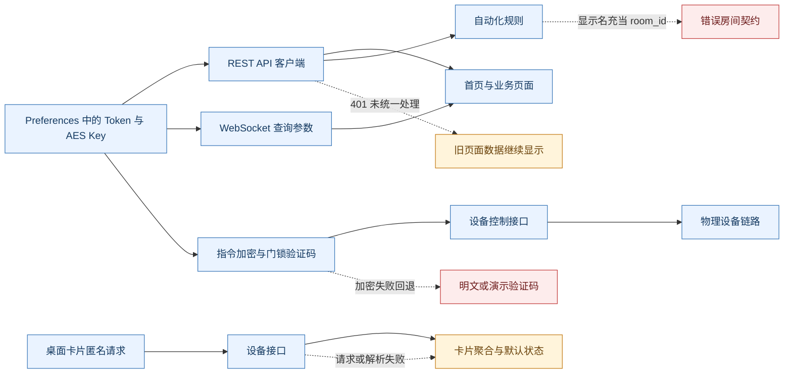

# 项目逻辑与工程改进审计

_检查基线：`demo` 分支 `f6139aa`，OpenHarmony API 20，2026-07-30。本文补充设备状态专项审计之外的认证、安全、自动化、监测、桌面卡片和工程质量问题。_

> 本文只记录当前客户端源码能够证明的行为。仓库不包含后端、设备固件、数据库或 CI 配置，因此服务端是否校验 JWT、如何解释 `room_id`、是否撤销会话等内容均需通过接口契约另行确认。

---

## 📋 执行摘要

本轮共确认 **27 项**改进点，其中严重 2 项、高风险 10 项、中风险 12 项、低风险 3 项。最优先处理的不是界面样式，而是几个会产生错误结果或安全降级的逻辑：

1. 指令加密失败后可能继续发送明文，门锁验证码还存在固定值和明文回退。
2. 修改密码接口返回 `false` 时，个人中心仍无条件提示“修改成功”。
3. 自动化规则把房间显示名加工后作为 `room_id` 发送，中文房间名很可能不符合服务端标识契约。
4. 桌面卡片读取 `/api/devices` 时不携带 Token，并把请求失败伪装成“设备全部关闭、门锁已锁”。
5. Token 过期没有统一退出机制，首页 REST 与 WebSocket、规则开关与列表刷新均存在竞态。

| 维度 | 结论 | 首要动作 |
|---|---|---|
| 认证与安全 | 存在失败开放、明文传输和会话失效处理缺口 | 所有安全失败改为失败关闭，统一处理 `401/403` |
| 自动化 | 房间标识契约错误风险最高，选择与并发状态也不稳定 | 补充权威 `room_id`，为规则操作增加忙碌态 |
| 数据监测 | “实时数据”仅进入页面或手动刷新，时间与排序假设未被验证 | 标注数据时间，统一时区并按时间排序 |
| 桌面卡片 | 认证、失败态、聚合语义和刷新策略均与主应用不一致 | 复用认证读取，失败显示未知，一次拉取更新全部卡片 |
| 工程质量 | 无自动化测试，当前本机 Hvigor 缓存损坏导致无法重新构建 | 先恢复构建链，再补关键纯函数与 API 契约测试 |

## 🔍 范围与限制

本次静态检查覆盖：

- 登录、注册、Token 恢复、密码修改和退出登录
- REST、WebSocket、Preferences、JWT 负载解析和 AES 指令包装
- 设备管理、自动化规则、数据监测和公共 UI 组件
- 桌面卡片数据抓取、聚合和刷新生命周期
- 应用清单、表单配置、依赖、忽略规则、测试目录和 README

设备状态字段解析、命令回写与每类设备显示一致性已在[设备显示状态与实际状态一致性检查](./device-status-consistency-audit.md)中单独记录，本文不重复展开。

验证限制如下：

| 项目 | 当前状态 | 影响 |
|---|---|---|
| 后端源码 | 不在仓库 | 无法确认服务端 `room_id`、Token 撤销、时间格式和加密契约 |
| API 20 冒烟测试 | 本轮未重新执行 | 本文结论以静态源码和既有运行记录为依据 |
| 当前 HAP 构建 | 未通过环境预检 | 本机 `.hvigor` 项目缓存缺少 `@ohos/hvigor/bin/hvigor.js`，尚未进入 ArkTS 编译 |
| 网络安全配置 | 激活状态未证实 | `network_security_config.xml` 存在，但清单和源码中未找到引用，不能断言已随应用生效 |

## 🔄 风险链路

## 🔐 认证与安全问题

| ID | 等级 | 问题 | 影响与源码证据 |
|---|---|---|---|
| P0-01 | 严重 | 指令加密失败后继续发送明文 | [`callService()`](../entry/src/main/ets/common/ApiClient.ets#L536) 先构造明文 `action/params`，仅在 `aesEncrypt()` 返回非空时替换；而 [`aesEncrypt()`](../entry/src/main/ets/common/CryptoUtil.ets#L32) 捕获异常后返回空字符串。加密异常会静默降级，不会阻止控制指令。 |
| P0-02 | 严重 | 门锁验证码存在固定值和明文回退 | [`generateAuthCode()`](../entry/src/main/ets/common/CryptoUtil.ets#L62) 在无密钥时返回 `demo-auth-code`，加密失败时返回 `plain:<payload>`，随机后缀还使用 `Math.random()`。门锁操作应失败关闭，不能以可预测或明文凭据继续。 |
| P0-03 | 高 | 默认 REST 使用 HTTP，WebSocket 将 JWT 放入 URL | [`DEFAULT_SERVER_URL`](../entry/src/main/ets/common/SecureStorage.ets#L3) 为公网 HTTP；[`MqttClient.ets`](../entry/src/main/ets/common/MqttClient.ets#L21) 生成 `ws://...?...token=`。控制数据可被窃听或篡改，URL 还可能进入代理和服务日志。 |
| P0-04 | 高 | Token 与 AES Key 存入普通 Preferences | [`saveAuthData()`](../entry/src/main/ets/common/SecureStorage.ets#L34) 持久化两项认证材料。应使用 HUKS 或等价安全存储，并避免长期保存可从 Token 派生的重复密钥。 |
| P0-05 | 高 | 会话恢复和失效处理不完整 | [`LoginPage`](../entry/src/main/ets/pages/LoginPage.ets#L22) 只要本地 Token 非空就进入首页；[`request()`](../entry/src/main/ets/common/ApiClient.ets#L283) 将 `401/403` 当普通错误，不清理会话或返回登录页。过期会话会反复失败并保留旧页面数据。 |
| P0-06 | 高 | 登录和注册未验证成功响应中的 Token | [`login()`](../entry/src/main/ets/common/ApiClient.ets#L349) 与 [`register()`](../entry/src/main/ets/common/ApiClient.ets#L366) 接受空 Token 并完成导航。异常的 2xx 响应可产生未认证但已进入主界面的状态。 |
| P1-03 | 中 | 当前加密实现缺少完整性并容忍错误密钥长度 | [`CryptoUtil.ets`](../entry/src/main/ets/common/CryptoUtil.ets#L7) 随机数失败时返回全零 IV；[`createSymKey()`](../entry/src/main/ets/common/CryptoUtil.ets#L17) 将密钥截断或补零至 32 字节；AES-CBC 本身不认证密文。建议改为服务端和客户端共同支持的认证加密，并严格校验密钥。 |
| P1-04 | 中 | Preferences 初始化不可恢复，退出会清除服务器地址 | [`initPreferences()`](../entry/src/main/ets/common/SecureStorage.ets#L12) 首次失败后保留已完成的 Promise，后续不会重试；[`clearAuthData()`](../entry/src/main/ets/common/SecureStorage.ets#L79) 调用 `clear()`，连 `server_url` 一并删除。 |

JWT 负载在 [`TokenUtil.ets`](../entry/src/main/ets/common/TokenUtil.ets#L22) 中仅做 Base64URL 解码，没有本地验签。客户端不应把未经可信通道确认的负载当成授权依据；若 `aes_key` 是后端协议的一部分，应明确其信任边界和轮换方式。

## ⚙️ 业务逻辑与生命周期问题

| ID | 等级 | 问题 | 影响与源码证据 |
|---|---|---|---|
| P0-07 | 高 | 修改密码失败可能被提示为成功 | [`changePassword()`](../entry/src/main/ets/common/ApiClient.ets#L738) 返回 `boolean`，但 [`ProfilePage.doPwd()`](../entry/src/main/ets/pages/ProfilePage.ets#L54) 忽略返回值，只要请求未抛异常就清空输入并提示成功。这是可直接复现的功能错误。 |
| P0-08 | 高 | 自动化将房间显示名当作 `room_id` | [`RuleTargetOption`](../entry/src/main/ets/model/DeviceModel.ets#L172) 只有 `room_name`；[`RulesPage`](../entry/src/main/ets/pages/RulesPage.ets#L71) 对显示名转小写、去空格后，在 [`buildActionJson()`](../entry/src/main/ets/pages/RulesPage.ets#L141) 作为 `room_id` 发送。中文名称不会变成权威 ID，可能导致规则作用房间错误或创建失败。 |
| P1-01 | 高 | 主动断开 WebSocket 仍会触发后台重连 | [`disconnectWS()`](../entry/src/main/ets/common/MqttClient.ets#L77) 调用 `close()`，但 `close` 回调在 [`MqttClient.ets`](../entry/src/main/ets/common/MqttClient.ets#L48) 无条件安排重连；新连接也不主动关闭旧连接，固定 5 秒重试且无退避。页面反复进出后可能存在额外连接。 |
| P1-02 | 高 | 首页 REST 与 WebSocket 并行覆盖 | [`DashboardPage.aboutToAppear()`](../entry/src/main/ets/pages/DashboardPage.ets#L255) 同时启动 `ld()` 和 `connectWS()`，而 REST 完成后整体替换设备数组。先到的实时状态可能被较旧 summary 覆盖。 |
| P1-05 | 中 | 规则开关存在重复请求和乱序回写 | [`dT()`](../entry/src/main/ets/pages/RulesPage.ets#L82) 没有每条规则的忙碌态，快速切换会并发执行 `toggleRule()` 和 `getRules()`，后完成的旧请求可能覆盖新状态。规则选项又被 `optionsLoaded` 永久缓存，设备或房间变化后可能过期。 |
| P1-06 | 中 | 规则选择标识和输入校验不足 | [`selectedTrigger()`](../entry/src/main/ets/pages/RulesPage.ets#L349) 只按 `value + field` 查找，同类传感器跨房间时会选中首个匹配项；阈值只验证是数字，没有温湿度有效范围；列表摘要在 [`as()`](../entry/src/main/ets/pages/RulesPage.ets#L279) 只展示第一项动作。 |
| P1-07 | 中 | “实时数据”并不自动更新 | [`DataMonitorPage`](../entry/src/main/ets/pages/DataMonitorPage.ets#L42) 只在进入页面和手动刷新时调用接口，没有 WebSocket 或轮询。用户长时间停留时仍会看到旧值。 |
| P1-08 | 中 | 历史数据依赖未声明的时间和排序假设 | [`apiTime()`](../entry/src/main/ets/pages/DataMonitorPage.ets#L133) 发送无时区的本地时间；[`historySummary()`](../entry/src/main/ets/pages/DataMonitorPage.ets#L147) 假设返回值按新到旧排列；[`historyInsight()`](../entry/src/main/ets/pages/DataMonitorPage.ets#L161) 扫描整个窗口，可能把旧异常描述成“当前”异常。 |
| P1-09 | 中 | 设备管理初始加载串行且总会扫描候选设备 | [`DeviceManagePage.ld()`](../entry/src/main/ets/pages/DeviceManagePage.ets#L135) 依次读取设备、房间并调用 discovery。设备与房间可并行，候选扫描只应在“待绑定”首次打开或用户点击扫描时执行。 |
| P1-10 | 中 | 编辑、删除和规则操作缺少对象级防重复 | 设备删除与保存见 [`DeviceManagePage`](../entry/src/main/ets/pages/DeviceManagePage.ets#L175)，规则删除与切换见 [`RulesPage`](../entry/src/main/ets/pages/RulesPage.ets#L82)。确认弹层已经存在，但提交按钮没有对象级 busy 状态，连续点击可能重复发送。 |
| P2-02 | 中 | 页面状态和错误本地化逻辑分散 | 多个页面各自复制 `localizeMessage()`、加载状态和缓存处理；会话失效、网络错误和旧数据提示无法保持一致。应先提取统一错误映射和会话失效事件，再评估是否需要集中状态仓库。 |
| P2-06 | 中 | 账户安全策略仅有最小长度校验 | [`ProfilePage`](../entry/src/main/ets/pages/ProfilePage.ets#L54) 只验证新密码不少于 6 位，未限制最大长度，也未在成功后强制重新认证或说明其他会话处理。最终策略需与后端共同确定。 |

## 🧩 桌面卡片与公共组件问题

| ID | 等级 | 问题 | 影响与源码证据 |
|---|---|---|---|
| P0-09 | 高 | 桌面卡片匿名读取设备并伪装失败态 | [`fetchDeviceData()`](../entry/src/main/ets/entryformability/EntryFormAbility.ets#L53) 请求 `/api/devices` 时只有 `Content-Type`；异常后 [`defaultFormPayload()`](../entry/src/main/ets/entryformability/EntryFormAbility.ets#L16) 返回灯关、空调关、门锁已锁等可信外观。认证失败或断网不应显示为真实设备状态。 |
| P1-11 | 中 | 单个坏设备可中断整张卡片，聚合语义不一致 | 循环中的 `JSON.parse()` 没有单设备隔离；温湿度和门锁由最后一个同类设备覆盖，灯光、空调等则表示“任一开启”。数组顺序会改变卡片结果。见 [`EntryFormAbility.ets`](../entry/src/main/ets/entryformability/EntryFormAbility.ets#L72)。 |
| P1-12 | 中 | 卡片刷新重复请求且生命周期策略冲突 | [`refreshAllForms()`](../entry/src/main/ets/entryformability/EntryFormAbility.ets#L121) 为每个 form ID 单独抓取同一份数据；代码自建 60 秒定时器，同时 [`form_config.json`](../entry/src/main/resources/base/profile/form_config.json#L14) 又启用系统更新和可见通知，但没有实现可见/不可见回调。应统一为系统调度或可见期轮询。 |
| P2-01 | 低 | 公共提示条和装饰动画有布局、功耗隐患 | [`StatusBanner`](../entry/src/main/ets/common/ControlCenterKit.ets#L123) 将主文案和详情放在单行 Row，长文本可能挤压；[`SmartHomeLogo`](../entry/src/main/ets/common/SmartHomeLogo.ets#L19) 每 50 毫秒更新状态，只为装饰脉冲。可改为纵向换行和低频/声明式动画。 |

## 🏗️ 工程质量与配置问题

| ID | 等级 | 问题 | 影响与源码证据 |
|---|---|---|---|
| P2-03 | 高 | 没有自动化测试，当前构建环境也不可复验 | `entry/src/test/` 与 `entry/src/ohosTest/` 均不存在。运行 `assembleHap` 时本机 `.hvigor` 项目缓存缺少 `@ohos/hvigor/bin/hvigor.js`，在源码编译前失败，因此当前 HEAD 尚无可重复的构建证明。 |
| P2-04 | 低 | README 含已过时结论，API 存在未使用出口 | 当前已有 `.gitignore`，且 [`build-profile.json5`](../build-profile.json5#L1) 没有签名口令，但 README 仍声称相反。`setBaseUrl()`、`createDevice()`、`sendCommand()`、`getStates()`、`getDevicesFromStates()`、`getScenes()` 没有调用方，应确认保留目的或移除。 |
| P2-05 | 低 | 服务器配置能力和网络策略状态不清晰 | [`setBaseUrl()`](../entry/src/main/ets/common/ApiClient.ets#L257) 没有 UI 调用方，应用通常固定使用默认公网地址；宽松的 [`network_security_config.xml`](../entry/src/main/resources/rawfile/network_security_config.xml#L1) 未找到清单引用。应明确开发/生产环境注入方式，并验证配置是否实际生效。 |

仓库卫生本身目前正常：生成目录、IDE 配置、本机 SDK 路径和日志均已被 `.gitignore` 排除，跟踪文件中也未发现签名材料。这部分无需按旧 README 的建议重复整改。

## 🗓️ 两天内可完成的改进计划

以下时间盒按一名熟悉 ArkTS 的开发者、后端接口保持可用计算。目标是先消除客户端可独立修复的错误行为，不在两天内承诺完成 TLS、HUKS、认证加密协议或后端规则契约改造。

| 时间 | 修改内容 | 涉及问题 | 验收标准 |
|---|---|---|---|
| 第 1 天上午 | 修复密码返回值判断；登录/注册拒绝空 Token；统一 `401/403` 会话清理和返回登录页 | P0-05、P0-06、P0-07 | `success=false` 不再提示成功；空 Token 不进入首页；过期 Token 只触发一次退出 |
| 第 1 天下午 | 指令加密和门锁验证码改为失败关闭；删除固定值、明文、零 IV 回退；Preferences 失败允许重试且退出仅删除认证键 | P0-01、P0-02、P1-03、P1-04 | 任一加密前置条件失败时不发送控制请求；退出后保留服务器配置 |
| 第 2 天上午 | 修复 WebSocket 主动关闭重连和重复连接；首页首次 REST 完成前缓存实时消息；规则与设备操作增加对象级 busy 状态 | P1-01、P1-02、P1-05、P1-10 | 页面进出后只有一个连接；实时消息不被旧 REST 覆盖；连续点击只发一次请求 |
| 第 2 天下午 | 桌面卡片携带认证、失败显示“状态不可用”、单设备容错、一次抓取更新全部卡片；补关键回归用例 | P0-09、P1-11、P1-12、P2-03 | 401/断网不再显示伪设备状态；坏 JSON 不影响其他设备；多卡片只发一次设备请求 |

自动化 `room_id` 应在两天内完成**契约确认和客户端模型修改**；若服务端当前没有返回权威房间 ID，则不能继续猜测，应单独排期补充后端字段。监测页的自动刷新可以在第二天余量内增加，但必须同时显示采样时间，并在页面离开时停止轮询。

## 🚀 中长期改进

| 优先级 | 建议 | 原因 |
|---|---|---|
| P0 | 服务端启用 HTTPS/WSS，生产构建禁用明文，并改用 Header 或短期握手票据认证 WebSocket | 客户端无法单方面消除传输窃听和 URL 泄露风险 |
| P0 | 由前后端共同迁移到认证加密、挑战响应和防重放门锁协议 | 当前 AES-CBC 与客户端自造验证码无法提供完整性和可靠身份确认 |
| P1 | 规则选项返回稳定的 `room_id`、`trigger_id`、单位和允许范围 | 消除显示名推导、跨房间选择冲突和非法阈值 |
| P1 | 为设备、历史和实时消息定义时间戳、排序及版本契约 | 页面才能拒绝迟到数据并准确表达“当前”状态 |
| P1 | 使用 HUKS 保存必要认证材料，服务端支持刷新与撤销 Token | 降低本地提取和长期会话风险 |
| P1 | 建立 API DTO 契约测试、状态纯函数单测和 API 20 设备冒烟测试 | 当前高风险逻辑没有自动回归保护 |
| P2 | 统一错误映射、会话状态和请求生命周期，清理死代码及过时 README | 降低页面间行为差异和后续维护成本 |

## ✅ 回归验收清单

- [ ] `changePassword()` 返回 `false`、HTTP 4xx 和网络失败均不会显示成功
- [ ] 登录或注册响应缺少 Token 时停留在认证页并显示可理解错误
- [ ] Token 过期后清理认证数据、停止 WebSocket，并只导航一次登录页
- [ ] AES Key 缺失、长度异常、随机数失败或加密失败时不发送设备控制请求
- [ ] 门锁操作不再产生 `demo-auth-code`、`plain:` 或 `Math.random()` 凭据
- [ ] 首页反复进入退出 20 次后始终只有一个 WebSocket，主动离开不重连
- [ ] REST 与 WebSocket 交换完成顺序时，最终设备状态一致
- [ ] 自动化提交使用服务端权威房间 ID，同类跨房间传感器可独立选中
- [ ] 快速切换规则或连续点击删除、保存时每个对象只有一个在途请求
- [ ] 数据监测显示数据时间，排序不依赖服务端数组顺序，旧异常不标为“当前”
- [ ] 桌面卡片在未登录、401、断网和坏 JSON 下显示“状态不可用”而非设备全关
- [ ] `assembleHap --stacktrace` 在干净环境完成，API 20 登录、控制、规则、监测、个人中心和桌面卡片冒烟通过

## 📎 证据索引

| 领域 | 主要文件 |
|---|---|
| API 与认证 | [`ApiClient.ets`](../entry/src/main/ets/common/ApiClient.ets)、[`SecureStorage.ets`](../entry/src/main/ets/common/SecureStorage.ets)、[`TokenUtil.ets`](../entry/src/main/ets/common/TokenUtil.ets) |
| 加密与门锁 | [`CryptoUtil.ets`](../entry/src/main/ets/common/CryptoUtil.ets)、[`DeviceRemotePage.ets`](../entry/src/main/ets/pages/DeviceRemotePage.ets) |
| 自动化 | [`RulesPage.ets`](../entry/src/main/ets/pages/RulesPage.ets)、[`DeviceModel.ets`](../entry/src/main/ets/model/DeviceModel.ets) |
| 监测与设备管理 | [`DataMonitorPage.ets`](../entry/src/main/ets/pages/DataMonitorPage.ets)、[`DeviceManagePage.ets`](../entry/src/main/ets/pages/DeviceManagePage.ets) |
| 实时链路 | [`MqttClient.ets`](../entry/src/main/ets/common/MqttClient.ets)、[`DashboardPage.ets`](../entry/src/main/ets/pages/DashboardPage.ets) |
| 桌面卡片 | [`EntryFormAbility.ets`](../entry/src/main/ets/entryformability/EntryFormAbility.ets)、[`form_config.json`](../entry/src/main/resources/base/profile/form_config.json) |
| 工程配置 | [`module.json5`](../entry/src/main/module.json5)、[`build-profile.json5`](../build-profile.json5)、[`.gitignore`](../.gitignore) |
