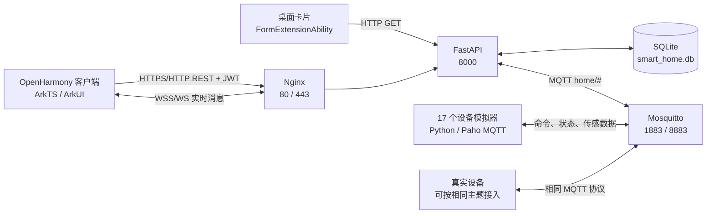
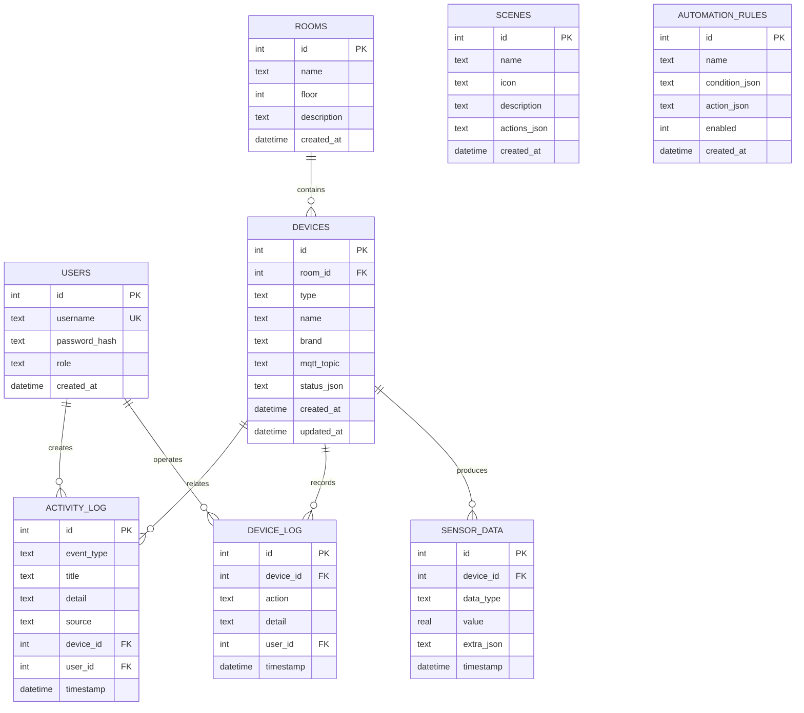
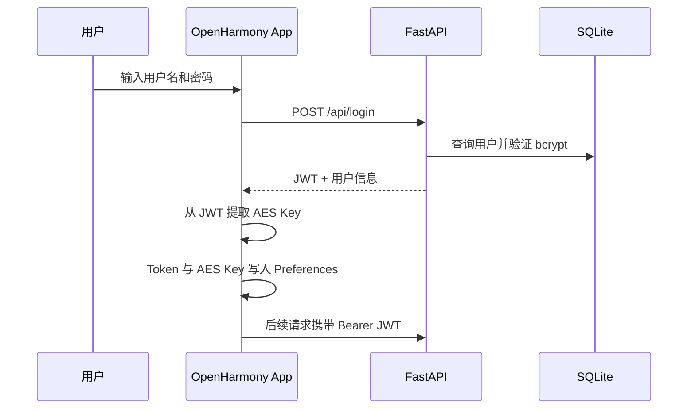
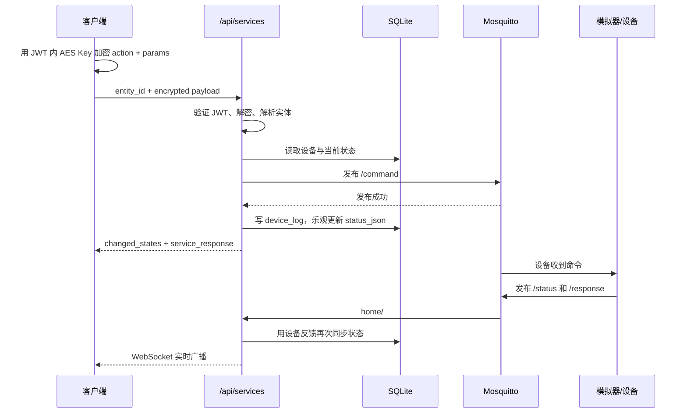

# 智能家居 A9 项目完整解析

> 分析基准：2026-07-30 当前工作区  
> 项目版本：`1.0.0`  
> OpenHarmony 包名：`com.smarthome.a9`  
> 最近提交：`7a449261 feat: complete smart home functionality and delivery polish`  
> 说明：本文以当前源码和配置为事实依据，历史设计稿、计划文档和测试报告只作为补充证据。当前工作区存在未提交修改，因此本文描述的是“当前目录状态”，不完全等同于最近一次 Git 提交。

## 1. 项目概览

本项目是第十五届中国软件杯 A9 赛题“基于 OpenHarmony 的家居设备控制系统”的端云一体实现。它不是单纯的移动端界面，而是一套可以在没有真实硬件时完成演示闭环的智能家居系统，包含：

- OpenHarmony ArkTS/ArkUI 客户端；
- FastAPI REST API 与 WebSocket 后端；
- SQLite 本地持久化；
- Eclipse Mosquitto MQTT 消息总线；
- 17 个默认虚拟设备组成的 Python 模拟器；
- Nginx HTTPS 入口；
- Docker Compose 本地/服务器部署；
- 远程 SSH 部署脚本；
- 回归测试、设计稿、实施计划、构建日志和交付文档。

当前实现的核心价值是：用户可在 OpenHarmony 客户端登录，查看房间和设备，绑定候选设备，控制灯光、空调、门锁、窗帘和加湿器，查看温湿度与日志，执行场景，并通过传感器消息触发自动化规则。

## 2. 代码规模与仓库组成

排除 `tmp`、`output`、OpenHarmony 构建目录、Python 缓存后，项目约有 192 个文件。其中核心源码规模如下：

| 区域 | 文件数 | 约代码行数 | 主要语言 |
| --- | ---: | ---: | --- |
| 后端应用 | 31 | 3,072 | Python |
| 设备模拟器 | 10 | 629 | Python |
| OpenHarmony 客户端 | 22 | 7,111 | ArkTS/ETS |
| 回归测试 | 19 个测试文件 | 142 个测试函数 | Python |

仓库中的 `build`、`tmp`、`output`、数据库、证书、缓存和截图属于构建产物、运行数据或验证资料，不应与核心源码混淆。

## 3. 目录结构

```text
smart-home-A9/
├── cloud/
│   ├── backend/
│   │   ├── app/
│   │   │   ├── api/           # REST API 路由
│   │   │   ├── database/      # SQLite 连接、建表、种子数据与兼容修复
│   │   │   ├── services/      # MQTT、命令、状态、规则、安全等领域服务
│   │   │   └── main.py        # FastAPI 生命周期、路由、MQTT 入站处理、WebSocket
│   │   ├── tests/             # 后端接口和集成测试
│   │   ├── Dockerfile
│   │   └── requirements.txt
│   ├── simulators/            # 传感器和执行器模拟器
│   ├── mosquitto/             # MQTT 配置、证书与运行数据
│   ├── nginx/                 # HTTPS 反向代理配置与证书
│   ├── docker-compose.yml     # 四服务编排
│   ├── start.bat / start.sh   # 本地一键启动
│   └── deploy.sh              # 服务器端部署辅助脚本
├── openharmony/
│   ├── AppScope/              # 应用级配置与资源
│   ├── entry/
│   │   ├── src/main/ets/
│   │   │   ├── common/        # API、WebSocket、加密、存储、主题和公共组件
│   │   │   ├── entryability/  # 主 UIAbility
│   │   │   ├── entryformability/ # 桌面卡片 Ability
│   │   │   ├── model/         # 客户端数据模型
│   │   │   ├── pages/         # 8 个页面
│   │   │   └── widget/        # 桌面卡片 UI
│   │   └── src/main/resources/
│   ├── build-profile.json5    # API 20、签名与构建配置
│   └── hvigorw.bat / hvigorw.js
├── tests/                     # 跨模块与前端源码回归测试
├── docs/
│   ├── superpowers/specs/     # 设计说明
│   ├── superpowers/plans/     # 实施计划
│   ├── test-reports/          # 测试报告、图表和截图
│   ├── mockups/               # UI 概念图
│   └── deliverables/          # 产品设计说明书
├── deploy_remote.py           # 从本机通过 SSH/SFTP 部署云端栈
├── generate_framework_doc.py  # 早期框架文档生成脚本
└── A9智能家居项目框架文档.docx
```

## 4. 技术栈

| 层次 | 技术 | 当前用途 |
| --- | --- | --- |
| 客户端 | OpenHarmony API 20、ArkTS、ArkUI Stage 模型 | 页面、路由、桌面卡片、网络与本地存储 |
| HTTP API | FastAPI 0.115.6、Uvicorn | 认证、资源 CRUD、设备控制、聚合查询 |
| 实时通道 | WebSocket | 将后端收到的 MQTT 消息广播给客户端 |
| 设备总线 | Eclipse Mosquitto 2、Paho MQTT 1.6.1 | 命令下发、状态/传感数据上报 |
| 数据库 | SQLite 3、WAL、外键 | 用户、房间、设备、数据、日志、场景和规则 |
| 安全 | JWT HS256、bcrypt、AES-256-CBC、TLS 配置 | 身份认证、密码散列、命令体加密、传输加密 |
| 代理 | Nginx Alpine | HTTP 跳转 HTTPS、API/WebSocket 反向代理 |
| 容器 | Docker Compose | MQTT、后端、模拟器、Nginx 四服务编排 |
| 测试 | pytest、FastAPI TestClient、httpx | 后端接口、集成、前端源码约束和回归测试 |

## 5. 总体架构



后端是系统编排中心：HTTP API 面向客户端，MQTT 面向设备，SQLite 保存业务状态，WebSocket 将 MQTT 入站消息转换成客户端可消费的实时事件。

## 6. OpenHarmony 客户端解析

### 6.1 应用启动与导航

`EntryAbility` 在 `onCreate` 中初始化 Preferences，在 `onWindowStageCreate` 中加载 `pages/LoginPage`。登录页初始化统一 API 客户端，如果本地已有 Token 则直接进入仪表盘，否则等待登录。

页面清单：

| 页面 | 职责 | 主要后端接口 |
| --- | --- | --- |
| `LoginPage` | 登录、恢复本地会话 | `POST /api/login` |
| `RegisterPage` | 注册新用户 | `POST /api/auth/register` |
| `DashboardPage` | 全屋概览、房间筛选、设备入口、场景、活动、实时状态 | `GET /api/dashboard/summary`、场景执行、WebSocket |
| `DeviceManagePage` | 已绑定设备编辑/删除、候选设备扫描与绑定 | devices、discovery、bind_device |
| `DeviceRemotePage` | 灯、空调、门锁、窗帘、加湿器专用控制面板 | devices、services |
| `RulesPage` | 规则列表、启停、删除和表单化创建 | rules、rules/options |
| `DataMonitorPage` | 实时传感值、历史数据、活动与设备日志 | data/sensors、data/logs |
| `ProfilePage` | 用户信息、修改密码、退出登录 | auth/me、change-password |

仪表盘是主导航中心，底部导航通向设备、自动化、数据和个人中心。设备卡片可携带 `deviceType`、`deviceId` 参数进入遥控页。

### 6.2 公共客户端模块

| 模块 | 作用 |
| --- | --- |
| `ApiClient.ets` | 保存基础 URL/Token/AES Key，统一请求、错误映射、响应模型转换和全部 API 封装 |
| `MqttClient.ets` | 名称虽为 MQTT Client，实际连接的是后端 `/ws/realtime` WebSocket；断线后每 5 秒重连 |
| `SecureStorage.ets` | 基于 Preferences 保存 Token、AES Key 和服务器 URL |
| `TokenUtil.ets` | 解析 JWT Payload 中的 `aes_key` 和用户名，不负责验签 |
| `CryptoUtil.ets` | 使用 OpenHarmony Crypto Framework 生成 AES-256-CBC 命令密文 |
| `DeviceModel.ets` | REST/状态/规则/场景/日志的客户端模型与状态解析 |
| `ControlCenterTheme.ets` | 共享颜色与视觉令牌 |
| `ControlCenterKit.ets` | 共享底部导航、状态提示、区块标题等组件 |
| `UiText.ets` | 后端机器错误码和传输错误的中文映射 |

客户端默认服务端为 `http://8.162.10.179:8000`。底层仍保留 `setBaseUrl` 和服务器地址持久化能力，但登录页已不向用户暴露服务器配置入口。

### 6.3 实时更新策略

仪表盘出现时先调用摘要接口获取完整快照，再连接 WebSocket。后端广播以下结构：

```json
{
  "type": "mqtt",
  "topic": "home/livingroom/temperature_sensor/sensor",
  "payload": { "value": 25.1, "unit": "celsius", "ts": 1780000000 }
}
```

客户端只处理主题后缀为 `status`、`response` 或 `sensor` 的消息，根据 MQTT 基础主题匹配本地设备，将新字段合并到 `status_json`，然后更新温湿度与在线数量。WebSocket 不是设备协议的直接连接，客户端不直接访问 Mosquitto。

### 6.4 设备遥控能力

| 设备类型 | 控制能力 |
| --- | --- |
| 灯光 `light` | 开关、亮度 0-100、暖光/自然光/冷光 |
| 空调 `ac` | 开关、16-30℃、制冷/制热/除湿/送风/自动、风速 |
| 门锁 `door_lock` | 解锁、上锁、解锁后 5 秒自动回锁 |
| 窗帘 `curtain` | 打开、关闭、0-100% 位置 |
| 加湿器 `humidifier` | 开关、1-3 档、目标湿度 |

遥控页允许向显示为离线的设备发送命令，离线状态只作提示；按钮只在已有命令执行中被禁用。滑块命令有 250ms 防抖。每个遥控面板还会每 5 秒刷新当前房间的温湿度。

### 6.5 桌面卡片

`EntryFormAbility` 管理桌面卡片实例，默认每 60 秒拉取一次设备列表并汇总温度、湿度、灯、空调、门锁、窗帘和加湿器状态。卡片声明支持 `2*2` 和 `2*4`。

当前问题是卡片请求 `/api/devices` 时没有附带 JWT，而该接口要求认证，因此在正常安全配置下会收到 401，卡片会退回默认占位数据。这是一个已实现外壳但认证链路未闭合的功能。

## 7. 后端解析

### 7.1 启动生命周期

FastAPI `lifespan` 依次执行：

1. 记录主 asyncio 事件循环；
2. 创建/升级 SQLite 表并写入默认数据；
3. 初始化 MQTT 客户端；
4. 订阅 `home/#`；
5. 从数据库加载已启用自动化规则到内存；
6. 应用停止时断开 MQTT。

MQTT 连接失败不会阻止 API 启动，但控制接口随后会因无法发布消息返回 502。

### 7.2 API 模块

除根路由、健康检查、登录和注册外，业务 API 都要求 `Authorization: Bearer <JWT>`。

| 方法与路径 | 作用 | 认证 |
| --- | --- | --- |
| `GET /` | 服务名称、版本和文档入口 | 否 |
| `GET /api/health` | 健康检查 | 否 |
| `POST /api/login` | 兼容登录入口 | 否 |
| `POST /api/auth/login` | 标准登录入口 | 否 |
| `POST /api/auth/register` | 注册 | 否 |
| `GET /api/auth/me` | 当前用户 | 是 |
| `PUT /api/auth/change-password` | 修改密码 | 是 |
| `GET/POST /api/rooms` | 房间列表、创建 | 是 |
| `GET/PUT/DELETE /api/rooms/{id}` | 房间详情、修改、删除 | 是 |
| `GET/POST /api/devices` | 设备查询、创建 | 是 |
| `GET/PUT/DELETE /api/devices/{id}` | 设备详情、修改、删除 | 是 |
| `POST /api/devices/{id}/command` | 兼容设备命令入口 | 是 |
| `GET /api/states` | Home Assistant 风格实体状态列表 | 是 |
| `GET/POST /api/states/{entity_id}` | 查询或直接写入实体状态 | 是 |
| `POST /api/states/{entity_id}/command` | 实体命令入口 | 是 |
| `POST /api/services` | 客户端实际使用的统一控制入口 | 是 |
| `POST /api/discovery` | 返回未绑定的确定性候选设备，不写数据库 | 是 |
| `POST /api/bind_device` | 将候选设备原子绑定到真实房间 | 是 |
| `GET /api/dashboard/summary` | 首页房间、设备、场景、日志聚合 | 是 |
| `GET /api/data/sensors` | 传感器历史查询，最多 1000 条 | 是 |
| `GET /api/data/logs` | 设备日志与活动日志合并查询 | 是 |
| `GET/POST /api/rules` | 规则列表、创建 | 是 |
| `GET /api/rules/options` | 可用触发器、运算符、目标和动作 | 是 |
| `PUT/DELETE /api/rules/{id}` | 修改、删除规则 | 是 |
| `POST /api/rules/{id}/toggle` | 启停规则 | 是 |
| `GET/POST /api/scenes` | 场景列表、创建 | 是 |
| `GET/PUT/DELETE /api/scenes/{id}` | 场景详情、修改、删除 | 是 |
| `POST /api/scenes/{id}/execute` | 顺序发布场景内全部 MQTT 动作 | 是 |
| `WS /ws/realtime?token=...` | MQTT 消息实时广播 | JWT 查询参数 |

实体 ID 格式为 `<device_type>.device_<database_id>`，例如 `light.device_4`。

### 7.3 服务层职责

| 服务 | 职责 |
| --- | --- |
| `device_command.py` | 解密命令、读取设备、发布 MQTT、写控制日志、乐观更新状态 |
| `device_view.py` | 解析状态、生成中文摘要、计算在线状态、标准化最后在线时间 |
| `entity_state.py` | 设备行与 Home Assistant 风格状态互转 |
| `mqtt_client.py` | MQTT 单例连接、主题订阅、发布、简单 `/#` 匹配 |
| `rule_engine.py` | 内存规则编译、传感消息匹配、动作发布、活动日志 |
| `rule_payloads.py` | 条件和动作 JSON 校验与标准化 |
| `discovery_catalog.py` | 固定候选设备目录、未绑定过滤和数据库绑定 |
| `security.py` | bcrypt、JWT、AES-256-CBC |
| `ac_brand.py` | 格力、海尔、美的统一空调参数到品牌命令的翻译 |
| `activity_log.py` | 场景和规则等非直接设备活动的统一记录 |

### 7.4 在线状态定义

设备没有独立心跳表或连接表。`device_view.is_device_online()` 将 `updated_at` 距当前时间不超过 10 分钟的设备视为在线。以下行为会刷新 `updated_at`：

- 收到设备 `status`、`response` 或 `sensor` MQTT 消息；
- 控制命令成功发布后进行乐观状态更新；
- 直接调用状态写入 API。

因此“在线”更准确地表示“10 分钟内有状态活动”，不是 Broker 级别的实时连接证明。

## 8. 数据库设计

SQLite 使用 `journal_mode=WAL` 和 `foreign_keys=ON`，每次请求通过上下文管理器自动提交或回滚。



`status_json`、`actions_json`、`condition_json` 和 `action_json` 采用 JSON 字符串而不是规范化子表，适合比赛演示和快速扩展，但查询、约束、迁移和局部更新能力较弱。

初始化逻辑仅在房间表为空时插入全套默认数据；非空旧数据库只执行已知规则 JSON 修复、回家场景升级和 `devices.updated_at` 列补齐。它不是通用迁移系统。

## 9. 默认数据与设备模型

默认账号为 `admin / admin123`，角色为 `admin`。默认有 3 个房间、17 个设备、3 个场景和 4 条自动化规则。

| 房间 | 设备 |
| --- | --- |
| 客厅 | 温度、湿度、人体感应、主灯、格力空调、门锁、窗帘 |
| 卧室 | 温度、湿度、人体感应、主灯、海尔空调、加湿器 |
| 书房 | 温度、灯、美的空调、窗帘 |

默认场景：

- 回家模式：三房灯光、三台空调、两组窗帘、加湿器开启，门锁保持上锁；
- 离家模式：关闭灯、空调、窗帘、加湿器并锁门；
- 睡眠模式：卧室暗光、空调 26℃，关闭客厅灯。

默认规则：人来开灯、人走关灯、高温自动制冷、高湿自动除湿。

## 10. MQTT 协议与设备模拟器

### 10.1 主题规范

每台设备使用 `home/{room_key}/{device_type}` 作为基础主题：

| 主题后缀 | 方向 | 内容 |
| --- | --- | --- |
| `/command` | 后端到设备 | `{"action":"on", ...params}` |
| `/status` | 设备到后端 | 当前状态 |
| `/sensor` | 传感器到后端 | 数值、单位、时间戳 |
| `/response` | 设备到后端 | `success` 与 `state` |

后端订阅 `home/#`。传感消息会同时进入规则引擎、传感历史表、设备状态同步和 WebSocket 广播；状态/响应消息进入状态同步和 WebSocket 广播。

### 10.2 模拟器行为

- 温度传感器：每 5 秒按均值 25℃、标准差 0.5 生成 15-38℃ 数据；
- 湿度传感器：每 5 秒按均值 55%、标准差 5 生成 20-95% 数据；
- PIR：每秒检查，随机每 10-30 秒切换有人/无人并只在变化时发布；
- 灯、空调、门锁、窗帘、加湿器：不主动产生周期数据，只响应命令并发布状态和响应；
- 空调模拟器可将统一状态翻译为格力、海尔、美的品牌命令，主要用于演示日志；
- 门锁模拟器目前只检查 `auth_code` 是否非空，不验证其密码学真实性。

模拟器管理器启动 17 个对象，每个设备拥有一个 MQTT 客户端和一个守护线程。

## 11. 核心业务流程

### 11.1 登录与会话



JWT 有效期默认 24 小时，Payload 包含用户 ID、用户名、角色和每次登录随机生成的 AES Key。

### 11.2 设备控制闭环



这里的“发布成功”只代表消息交给 MQTT 客户端，不代表真实设备已经执行。接口先乐观更新，随后才可能被设备反馈校正。

### 11.3 自动化规则

规则条件示例：

```json
{
  "trigger": "temperature_sensor",
  "field": "value",
  "operator": "gt",
  "value": 28,
  "and": [
    { "trigger": "ac", "field": "power", "operator": "eq", "value": "off" }
  ]
}
```

动作示例：

```json
[
  {
    "device_type": "ac",
    "room_id": "same",
    "action": "set",
    "params": { "power": "on", "mode": "cool", "temp": 26 }
  }
]
```

支持 `eq`、`neq`、`gt`、`gte`、`lt`、`lte`、`changed` 运算符。规则只在 MQTT 消息进入时执行，不是定时任务。新增、修改、删除或启停规则后会重新加载内存规则列表。

### 11.4 发现与绑定

发现不是网络扫描，而是从 `discovery_catalog.py` 的固定候选目录中，排除 MQTT 主题已存在的设备。目前有客厅氛围灯、卧室备用加湿器、书房窗帘扩展三个候选项。绑定使用 SQLite `BEGIN IMMEDIATE`，在同一写事务中验证房间、候选状态和重复主题，再写入 `devices`。

## 12. 配置与环境变量

| 环境变量 | 默认值 | 用途 |
| --- | --- | --- |
| `DATABASE_URL` | 后端目录下 `data/smart_home.db` | SQLite 地址 |
| `MQTT_BROKER` | `localhost` | MQTT 主机 |
| `MQTT_PORT` | `1883` | 明文 MQTT 端口 |
| `MQTT_TLS_PORT` | `8883` | TLS MQTT 端口 |
| `MQTT_USERNAME/PASSWORD` | 空 | Broker 认证 |
| `MQTT_USE_TLS` | `false` | 后端是否连接 MQTTS |
| `MQTT_CA_CERTS` | 空 | CA 证书路径 |
| `JWT_SECRET` | 内置开发密钥 | JWT 签名密钥 |
| `JWT_EXPIRE_HOURS` | `24` | Token 有效期 |
| `HOST` | `0.0.0.0` | Uvicorn 监听地址 |
| `PORT` | `8000` | Uvicorn 端口 |
| `DEBUG` | `true` | 日志和 reload 开关 |
| `CORS_ORIGINS` | `*` | CORS 来源列表 |

Compose 网络中后端和模拟器使用明文 MQTT `mqtt:1883`，对外同时暴露 1883 和 8883。Nginx 将 80 重定向到 443，并代理 `/api/`、`/ws/`、`/docs`、`/openapi.json` 和根路径。

## 13. 构建、运行与部署

### 13.1 本地云端栈

```powershell
cd D:\ruanjianbei\smart-home-A9\cloud
docker compose up -d --build
docker compose ps
docker compose logs -f
```

服务入口：

- FastAPI：`http://localhost:8000`
- Swagger：`http://localhost:8000/docs`
- Nginx HTTPS：`https://localhost`
- MQTT：`mqtt://localhost:1883`
- MQTTS：`mqtts://localhost:8883`
- WebSocket：`ws://localhost:8000/ws/realtime?token=<JWT>`

`docker compose config --quiet` 在本次分析环境中通过，仅提示顶层 `version: '3.8'` 已废弃。

### 13.2 OpenHarmony 构建

用 DevEco Studio 打开 `openharmony`，或在已配置 SDK/JDK 的终端执行：

```powershell
cd D:\ruanjianbei\smart-home-A9\openharmony
.\hvigorw.bat assembleHap
```

项目的 `compileSdkVersion`、`targetSdkVersion`、`compatibleSdkVersion` 均为 20。当前目录已有：

- `entry-default-signed.hap`，约 1.33 MB；
- `entry-default-unsigned.hap`；
- 两份记录 `BUILD SUCCESSFUL` 的 API 20 构建日志。

签名配置和 `local.properties` 含本机绝对路径，换机后必须重新配置，不能视为可移植构建配置。

### 13.3 远程部署

`deploy_remote.py` 读取 `SMART_HOME_SERVER`、`SMART_HOME_USER`、`SMART_HOME_PASS`，通过 Paramiko：

1. 登录服务器并检查系统；
2. 必要时安装 Docker/Compose；
3. 上传后端、模拟器、Nginx/Mosquitto 配置与证书；
4. 动态生成服务器 Compose；
5. 构建并启动容器；
6. 执行根路由和健康检查。

目标目录固定为 `/opt/smart-home-A9`。该脚本适合比赛环境快速部署，不具备成熟发布系统的增量、回滚、密钥托管和主机指纹校验能力。

## 14. 测试与验证现状

测试分为两组：

- `cloud/backend/tests`：认证、安全、房间、设备、状态、服务、规则、场景、数据、首页契约和端到端流程；
- 根目录 `tests`：部署 Compose 生成、OpenHarmony API 配置、页面布局、主题、中文日志格式、设备遥控、离线控制和无硬件环境演示等源码回归。

当前共发现 142 个测试函数。测试使用临时 SQLite 数据库，并 Mock MQTT 初始化和发布，以保证后端测试可重复且不依赖 Broker。

历史证据：

- 2026-07-08 报告记录根目录 `16 passed`、后端 `100 passed`；
- 同日报告中的早期 HAP 构建曾因 SDK 路径失败；
- 后续 `build-api20-final.log` 与 `build-api20-verify.log` 均记录 `BUILD SUCCESSFUL`，说明该构建问题后来已修复。

本次分析验证：

- Docker 29.5.3 与 Compose 5.1.4 可用；
- Compose 配置解析通过；
- 当前签名 HAP 存在；
- 当前环境没有可用的项目 Python/pytest 运行时：系统 Python 启动器指向不可创建的 WindowsApps 解释器，工作区自带 Python 未安装 pytest。因此本次没有重新执行 142 项测试，不能把历史通过结果等同于当前未提交代码的最新通过结果。

## 15. 安全设计与现实边界

已实现的安全机制：

- 密码用 bcrypt 哈希，不存明文；
- REST API 使用带过期时间的 JWT；
- WebSocket 在握手前校验 JWT；
- 客户端可对设备命令体使用 AES-256-CBC；
- Nginx 和 Mosquitto 都提供 TLS 监听配置；
- SQL 值使用参数绑定，动态更新列来自固定 Pydantic 模型字段。

当前安全边界与风险：

1. Compose 的 JWT 密钥有固定开发默认值，默认账号也是公开的 `admin/admin123`；
2. Mosquitto 的 1883 和 8883 均允许匿名访问，TLS 只加密传输，不认证客户端；
3. 客户端默认直接使用公网 HTTP 地址，并允许明文流量；
4. AES Key 放在 JWT Payload 中，任何持有 Token 的主体都能读取；CBC 密文也没有独立认证标签，因此它不能替代 TLS；
5. 门锁模拟器只判断认证码非空，后端也不验证门锁授权码；
6. 用户角色被写入 JWT，但业务 API 没有 RBAC 检查，普通用户与管理员权限实际相同；
7. 所有用户共享同一套房间和设备，没有家庭/租户归属；
8. 远程部署使用 `AutoAddPolicy` 接受未知 SSH 主机密钥；
9. OpenHarmony 签名配置中存在本机签名材料路径和密码字段，不应进入正式仓库或共享包；
10. CORS 默认 `*` 且允许凭据，生产环境应改为明确来源。

## 16. 主要技术问题与改进优先级

### P0：上线或真实设备接入前必须处理

1. 关闭匿名 MQTT，启用账号/ACL 或双向证书，并停止对公网暴露 1883；
2. 强制 HTTPS/WSS，移除客户端公网 HTTP 默认值，使用正式证书；
3. 从环境或密钥服务注入随机 JWT Secret，首次启动强制修改默认管理员密码；
4. 为门锁等安全设备设计服务端挑战/签名验证和明确授权策略；
5. 移除仓库内签名密码和机器相关签名路径，改用本机或 CI 密钥注入。

### P1：保证业务正确性

1. 场景执行目前逐条 MQTT 发布，任一中途失败会形成部分执行且没有补偿，也不会同步乐观状态；应返回每个动作结果并提供幂等/补偿策略；
2. 规则动作虽然允许 `device_id`，执行器实际忽略它，只按“房间 + 类型”生成主题；同房间同类型多设备时无法精确控制；
3. 规则引擎的辅助设备状态只来自进程启动后的 MQTT 消息，不从 SQLite 预热，`and` 条件在冷启动后可能暂时无法命中；
4. `changed` 运算符当前无历史比较，始终返回真；持续传感数据也没有冷却时间，规则可能每 5 秒重复触发；
5. API 控制入口没有统一校验设备类型支持的 action 和参数范围，非法动作仍可能发布到 MQTT；
6. `devices.mqtt_topic` 没有数据库唯一约束，普通设备创建接口可制造重复主题；
7. 删除已有历史数据/日志的设备可能因外键且无级联策略而失败；
8. 桌面卡片没有携带 JWT，受保护设备接口下无法获取真实数据；
9. 后端 MQTT 首次连接失败后没有显式重连调度，Paho 是否恢复取决于连接状态和调用路径。

### P2：可维护性与产品完整度

1. `/api/login` 与 `/api/auth/login` 重复，应保留兼容层并明确弃用策略；
2. 数据库只有局部手写兼容修复，应引入有版本号的迁移机制；
3. 页面文件较大，`DashboardPage`、`DeviceRemotePage`、`RulesPage` 均接近或超过 1,000 行，应拆分状态控制器和设备面板组件；
4. 客户端退出登录调用 `Preferences.clear()`，会连服务器 URL 一并清除，语义上应只清认证字段；
5. 服务健康检查只返回进程状态，没有检查 SQLite、MQTT 或模拟器可用性；
6. 仓库 README 仍描述较早的页面/目录结构，需要以本文或后续精简版 README 为准；
7. `docker-compose.yml` 的 `version` 字段已被 Compose v5 标记为废弃；
8. 缺少结构化日志、指标、追踪、数据保留/清理和备份策略。

## 17. 架构评价

这是一个完成度较高的比赛型全栈项目：端、API、消息总线、数据库、模拟设备和部署链路都已存在，且能够在无硬件条件下形成可演示闭环。后端已经通过共享设备展示层、统一服务调用、聚合首页、活动日志和规则选项接口，避免了客户端重复推导太多业务语义；客户端也已从早期功能页发展为有统一主题、底部导航、错误反馈和设备专属控制的产品形态。

它当前更适合“单家庭、可信网络、比赛演示或教学验证”，还不适合直接作为公网生产智能家居平台。最明显的差距不在 UI，而在设备身份、消息授权、状态确认语义、多用户隔离、规则稳定性和可运维性。

## 18. 建议的阅读顺序

新开发者可按以下顺序进入项目：

1. `cloud/docker-compose.yml`：先理解四个容器和端口；
2. `cloud/backend/app/main.py`：掌握生命周期、MQTT 入站和 WebSocket；
3. `cloud/backend/app/database/init_db.py`：理解业务数据和默认设备；
4. `cloud/backend/app/services/device_command.py`：理解控制主链路；
5. `cloud/backend/app/services/rule_engine.py`：理解自动化；
6. `openharmony/entry/src/main/ets/common/ApiClient.ets`：理解客户端与后端契约；
7. `DashboardPage.ets` 和 `DeviceRemotePage.ets`：理解主要用户流程；
8. `cloud/backend/tests` 与根目录 `tests`：理解被自动化锁定的行为；
9. `docs/superpowers/specs`：追溯历次设计决策，但最终以当前源码为准。

## 19. 总结

项目的真实主链路可以概括为：

```text
OpenHarmony UI
  -> JWT REST API
  -> FastAPI 业务服务
  -> MQTT command
  -> 模拟器/设备
  -> MQTT status/sensor/response
  -> SQLite + 规则引擎 + WebSocket
  -> OpenHarmony 实时刷新
```

当前系统已经具备完整演示能力和清晰的模块边界。继续演进时，应优先把“消息发布成功”升级为“设备可确认、可追踪、可补偿”，并围绕 MQTT 身份认证、生产密钥、用户/家庭隔离和规则执行稳定性补齐生产级基础设施。
